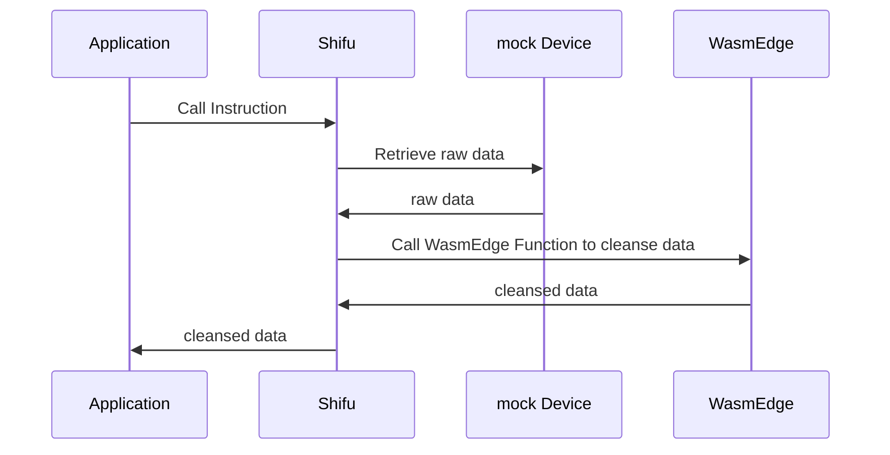

# Integrate WasmEdge in Shifu to Cleanse Data

This article will briefly describe how to integrate `WasmEdge` into ***Shifu*** to cleanse data collected from IoT devices.

## Background 🌇

When we use ***Shifu*** to collect data, it usually happens that the data collected from the device is in a different format from the data we need. To solve this problem, we can use ***Shifu*** + `WasmEdge` to process the data collected by ***Shifu*** through `WasmEdge` and then return it to our application.

The following is the simple logic.



:::tip `WasmEdge` Introduction 🏬

`WasmEdge` is a lightweight, high-performance `WebAssembly(WASM)` virtual machine optimized for the edge. `WasmEdge` can be used in a variety of scenarios such as severless cloud functions, SaaS, blockchain smart contracts, IoT, automotive real-time software applications, etc.
:::

## Prepare 🗂

1. `kubectl` v1.24.2
2. `docker` 20.10.16
3. `kind` v0.14.0
4. `git` 2.36.1

## Deployment 🔨

To make this article faster for you, you can download the program from Github with the following command. 🚀

```bash 
git clone https://github.com/Edgenesis/wasm-shifu-demo.git
cd wasm-shifu-demo
```

### Create a K8s Cluster 🐝

Use the following command to create a `k8s` cluster.

```bash
$ kind delete cluster && kind create cluster
Creating cluster "kind" ...
 ✓ Ensuring node image (kindest/node:v1.24.0) 🖼
 ✓ Preparing nodes 📦  
 ✓ Writing configuration 📜 
 ✓ Starting control-plane 🕹️ 
 ✓ Installing CNI 🔌 
 ✓ Installing StorageClass 💾 
Set kubectl context to "kind-kind"
You can now use your cluster with:
kubectl cluster-info --context kind-kind
Have a question, bug, or feature request? Let us know! https://kind.sigs.k8s.io/#community 🙂
```

### Build Shifu image 🪞

Use the following command to build a ***Shifu*** image.

```bash
$ make -f shifu/Makefile build-image-deviceshifu
$ kind load docker-image edgehub/deviceshifu-http-http:v0.0.6
$ docker images | grep edgehub/deviceshifu-http-http 
edgehub/deviceshifu-http-http v0.0.6 1d6b3544b8ad 54 minutes ago 36.1MB
```

### Run Virtual Devices 🔌

To make your experience easier, here we use a virtual appliance for simulation. 

Install and run the virtual appliance with port number `8099`.

```bash
$ docker build -f mockDevice/dockerfile -t mockdevice:v0.0.1 .
$ docker run -p 8099:8099 -itd mockdevice:v0.0.1 
bdfd2b1323be mockdevice:v0.0.1 ". /mockDevice" 19 seconds ago Up 18 seconds 0.0.0.0:8099->8099/tcp admiring_feistel
```

### Write Rules & Compile Wasm

You can write rules by using `JavaScript`. If you are not familiar with `JavaScript`, you can just use the default rules. 🥮  

Rule file path: `wasmEdge/js-func/src/js/run.js` You can achieve different functions by modifying the rule.

```bash
$ docker build -t wasm:v0.0.1 -f wasmEdge/js.dockerfile .
$ kind load docker-image wasm:v0.0.1
$ kubectl apply -f wasmEdge/k8s
```

You can check the `pod` operation of `WasmEdge` with the following command.

```bash
$ kubectl get pod -n wasmedge
NAME READY STATUS RESTARTS AGE
wasm-deployment-fbc9564d8-td428 1/1 Running 0 1s
```

## Install and Run Shifu

Install ***Shifu***.

```bash
$ kubectl apply -f shifuConfig/shifu_install.yml
$ kubectl get pod -n shifu-crd-system
NAME READY STATUS RESTARTS AGE
shifu-crd-controller-manager-5bbdb4d786-s6h4m 2/2 Running 0 1s
```

Install ***deviceShifu*** to connect with ***mockDeivce***. Before doing so, please change the `address` in the `shifuConfig/task3/task3.yaml` file to the IP of your computer.

```yaml
spec:
  sku: "E93"
  connection: Ethernet
  address: "192.168.14.163:8099"
```

Deploy and run ***deviceShifu*** with the following command. 🏖

```bash
$ kubectl apply -f shifuConfig/task3
$ kubectl get pod -n deviceshifu
NAME READY STATUS RESTARTS AGE
deviceshifu-demodevice-deployment-5589b55569-l5nb2 1/1 Running 0 4s
```

## Experience 🕹

You can start a `nginx` to communicate with ***deviceShifu***.

```bash
$ kubectl run nginx --image=nginx:1.21
$ kubectl get pod 
NAME READY STATUS RESTARTS AGE
nginx 1/1 Running 0 3s
```

With the following command, you can interact with ***Shifu*** to clean the data collected from IoT devices. 🛁

```bash
$ kubectl exec -it nginx -- curl -v http://deviceshifu-demodevice-service.deviceshifu.svc.cluster.local/get_info;echo
```

```json
[
   {
      "code":375287,
      "name": "atmospheric temperature",
      "val": "24.56",
      "unit":"°C",
      "exception": "Temperature is too high"
   },
   {
      "code":375287,
      "name": "Atmospheric Humidity",
      "val": "81.63",
      "unit":"%RH",
      "exception": "Humidity too high"
   }
]
```

Also we can use the following command to check the data generated by the IoT device.

```bash
$ curl localhost:8099/getInfo
```

```json
{
   "statusCode": "200",
   "message": "success",
   "entity":[
      {
         "dateTime": "2022-09-09 09:46:45",
         "eUnit":"℃",
         "eValue": "23.87",
         "eKey": "e1",
         "eName": "Atmospheric temperature",
         "eNum": "101"
      },
      {
         "dateTime": "2022-09-09 09:46:45",
         "eUnit":"%RH",
         "eValue": "80.62",
         "eKey": "e2",
         "eName": "Atmospheric Humidity",
         "eNum": "102"
      }
   ],
   "deviceId":950920,
   "deviceName": "950920",
   "deviceRemark": "2022-09-09 09:46:45"
}
```

Comparing the two outputs, we can see that we have successfully collected and cleaned the data to get the data we want. The comparison chart is as follows :


