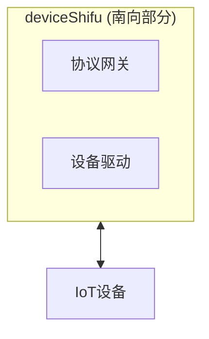
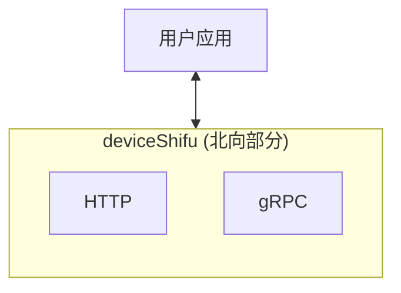

***Shifu*** 数据面的主要组件是 ***deviceShifu***。

### ***deviceShifu***

#### 简介

***deviceShifu*** 是整个 ***Shifu*** 的核心，也是开发者最应该关心的部分。***deviceShifu*** 以`Kubernetes Pod`的形式存在, 是一个实际设备的数字化表示或数字孪生。

每一个 ***deviceShifu*** 都与一个或多个实际设备相关联。用户通过和 ***deviceShifu*** 进行交互，就可以实现与实际设备的交互。

**南向** - ***deviceShifu*** 与IoT设备进行交互，将用户的请求通过协议网关或设备驱动进行转换并发送到设备。

**北向** - ***deviceShifu*** 将收集的设备数据通过HTTP协议(gRPC协议暂未支持)进行转换并发送给用户端。

#### 设计文档

如果你对 ***deviceShifu*** 内部细节感兴趣,可以前往[***deviceShifu*** 设计文档](https://github.com/Edgenesis/shifu/blob/main/docs/design/design-deviceShifu-zh.md)进一步阅读。
