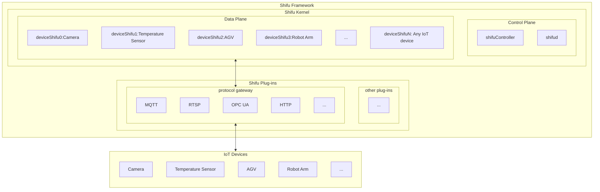
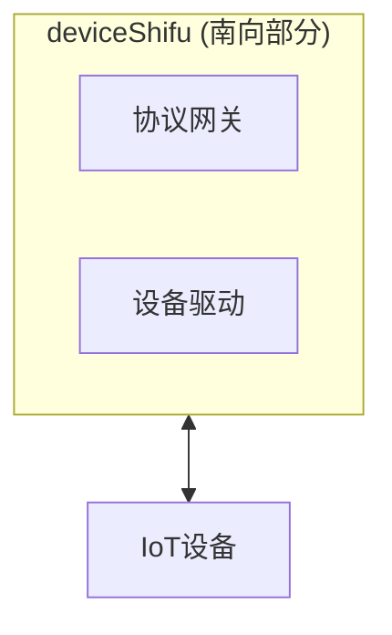
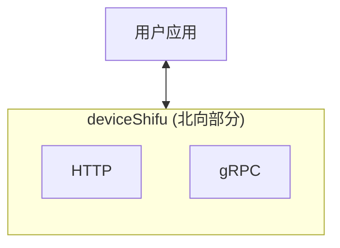

--- 
title: Shifu 基本架构
sidebar_position: 11
--- 

# Shifu 架构
Shifu是一个[Kubernetes](https://kubernetes.io/)原生的平台，它的所有组件都以[Pod](https://kubernetes.io/docs/concepts/workloads/pods/)的形式运行。下图是Shifu架构的示意图。 

本文是一个Shifu架构的简介，如读者对Shifu的具体架构设计感兴趣，请点击[这里](https://github.com/Edgenesis/shifu/blob/main/docs/design/design-shifu-zh.md)。

**注意：示意图内的IoT设备以及协议范围不仅限于图中的种类。Shifu的极强扩展性使得Shifu可轻松扩展，兼容所有通过任意协议/驱动通信的IoT设备。**

## 数据面 Data Plane
Shifu的数据面的主要组件是`deviceShifu`。

### deviceShifu
#### 简介
`deviceShifu`是整个Shifu Framework的核心，也是开发者最应该关心的部分。`deviceShifu`以Kubernetes Pod的形式存在, 是一个`实际设备的数字化表示`或`数字孪生`。

每一个`deviceShifu`都与一个或多个实际设备相关联。用户与`DeviceShifu`进行交互，就可以实现与实际设备的交互。

**南向** - `deviceShifu`与IoT设备交互，并且对用户的请求经过协议网关和设备驱动进行转换并发送到设备。

**北向** - `deviceShifu`将收集的设备数据通过HTTP或gRPC转换发送给用户端。

#### 设计文档
`deviceShifu`的具体设计文档在[这里](https://github.com/Edgenesis/shifu/blob/main/docs/design/design-deviceShifu-zh.md)。对内部细节感兴趣的读者可以进一步阅读。

## 控制面 Control Plane
Shifu的控制面的主要组件是`shifuController`和`shifud`。

### shifuController
#### 简介
`shifuController`是用来控制Shifu自定义的一个[Kubernetes CRD](https://kubernetes.io/docs/tasks/extend-kubernetes/custom-resources/custom-resource-definitions/) `EdgeDevice`，它描述了一个连接到Shifu的实际设备的各项信息。

每一个EdgeDevice拥有两个部分：
`EdgeDeviceSpec` 和 `EdgeDevicePhase`.

EdgeDeviceSpec包含了设备的基本信息。它拥有四个元素：
| 变量名 | 变量类型 | 用途 | 例子 |
|--|--|--|--|
|	Sku | \*string | 设备的SKU名称 | PLC, Hikvision camera |
|	Connection | \*Connection | 硬件连接方式 |Ethernet, USB|
| Address | \*string | 硬件地址 | 192.168.0.1 |
|	Protocol | \*Protocol | 传输协议 |HTTP, MQTT, Socket...|

EdgeDevicePhase定义了设备的当前状态：
| 状态 | 含义 |
|--|--|
| Pending | 设备已被识别，但接入Shifu尚未完成 |
| Running | 设备已成功接入Shifu并正在运行 |
| Failed | 设备接入Shifu失败 |
| Unknown | 未知状态 |

#### 设计文档
`shifuController`的具体设计文档在[这里](https://github.com/Edgenesis/shifu/blob/main/docs/design/design-shifuController-zh.md)。对内部细节感兴趣的读者可以进一步阅读。

### shifud
#### 简介
`shifud`是一个运行在每个Kubernetes节点上的DaemonSet，主要负责设备发现、验证和更新。

#### 设计文档
`shifud`的具体设计文档在[这里](https://github.com/Edgenesis/shifu/blob/main/docs/design/design-shifud-zh.md)。对内部细节感兴趣的读者可以进一步阅读。

## Shifu Plug-ins
Shifu在持续加入新的工具类服务来保证不同协议和驱动的兼容。

### MQTT Broker
MQTT Broker被用来帮助MQTT信息的订阅和发布。当前，Shifu使用了[Mosquitto](https://mosquitto.org/)来实现兼容。

### RTSP Client
RTSP Client保证了流媒体信息的传输。

### Siemens S7 Suite
Siemens S7 Suite支持了西门子S7系列PLC的操作。当前，Shifu使用了[Snap7](http://snap7.sourceforge.net/)来实现兼容。

### HTTP to SSH driver stub
HTTP to SSH driver stub使得Shifu可以允许用户任意添加新的命令行驱动。 参见[快速上手：添加新的命令行驱动](shifu-tuorial/remote-driver-execution.md)。
