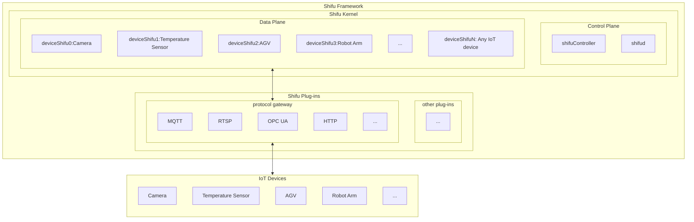

--- 
title: 基本架构
sidebar_position: 0
--- 

# ***Shifu*** 基本架构

***Shifu*** 是一个[Kubernetes](https://kubernetes.io/)原生的平台，它的所有组件都以[Pod](https://kubernetes.io/docs/concepts/workloads/pods/)的形式运行。

本文是关于 ***Shifu*** 架构的简介，如果你对 ***Shifu*** 的架构设计感兴趣，可以前往[desing-shifu-zh](https://github.com/Edgenesis/shifu/blob/main/docs/design/design-shifu-zh.md)查看具体细节。

下图是 ***Shifu*** 架构的示意图：

**注：示意图内的IoT设备以及协议不仅限于图中出现的种类。Shifu 具有极强的扩展性，兼容所有通过协议或驱动通信的IoT设备。**
