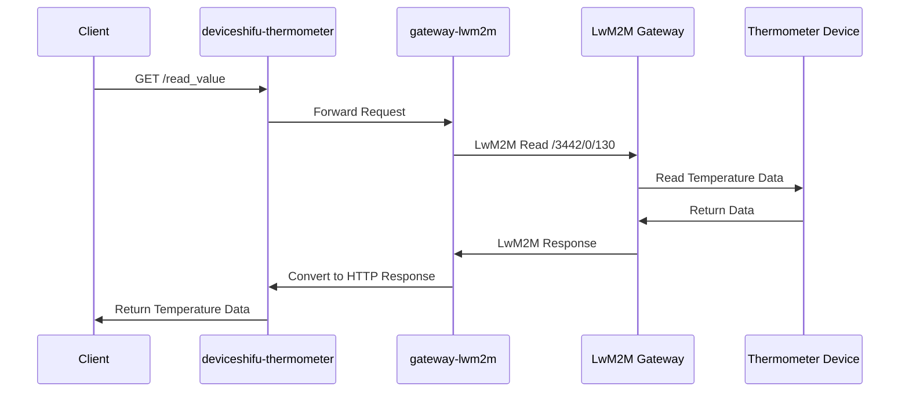

# Connect a HTTP Device Via Gateway

## Introduction to LwM2M Gateway

The LwM2M (Lightweight Machine to Machine) Gateway consists of two main components: an LwM2M client that connects to the LwM2M server and an HTTP client that connects to deviceShifu.  The LwM2M Gateway enables deviceShifu to adapt to the LwM2M protocol, handle requests from the LwM2M server, and push data to the cloud, fulfilling the two major functions required by the LwM2M protocol: the capability to pull data from the device and post data from the cloud to the device.

## Pull and Deploy the Shifu Project

Before pulling the project from GitHub, you need to download the relevant Git environment, which can be quickly installed using yum. After setting up Git, clone Shifu to your local machine. Finally, please use the latest configuration file to ensure support for the latest protocols.

```shell
sudo yum -y install git
git clone https://github.com/Edgenesis/shifu.git
kubectl apply -f pkg/k8s/crd/install/shifu_install.yml
```

## Get the Example and Deploy LwM2M deviceShifu

We'll take connecting a HTTP-based thermometer as an example. Below is the general data flow of our access:



1. First, we deploy the corresponding LwM2M gateway. The code is located in `examples/lwm2m_gw_http/deviceshifu-lwm2m`. Let's deploy them in the cluster.

```bash
kubectl apply -f examples/lwm2m_gw_http/deviceshifu-lwm2m
```

2. Configure the exposed client service and the gateway component for HTTP and LwM2M conversion

```bash
kubectl apply -f examples/lwm2m_gw_http/deviceshifu-thermometer
```

3. Ensure device connection. Our example includes a virtual thermometer device for your testing convenience.

The `kubectl` command allows you to view the status of ***deviceShifu***:

```bash
kubectl get pods -n deviceshifu
```
We can see that `deviceshifu-lwm2m-deployment` and `deviceshifu-thermometer-deployment` are running normally.
```shell
NAME                                                 READY   STATUS    RESTARTS      AGE
deviceshifu-lwm2m-deployment-794ddd9978-z7lcq        1/1     Running   2 (44m ago)   44m
deviceshifu-thermometer-deployment-b98fbbcf8-6g69b   2/2     Running   3 (42m ago)   43m
```

## Running Results

We can check our exposed ports using the following command:

```shell
kubectl get svc -n deviceshifu
```

```shell
NAME                        TYPE           CLUSTER-IP     EXTERNAL-IP   PORT(S)                       AGE
deviceshifu-lwm2m-service   NodePort       10.43.47.30    <none>        80:30080/TCP,5683:30000/UDP   47m
deviceshifu-thermometer     LoadBalancer   10.43.64.126   <pending>     80:31703/TCP                  46m
```

As we can see, the external client service port is 31703. Let's test it using curl, apifox, or postman.

```shell
curl http://<Your Server IP>:31703/read_value
```

Test result reference:

```shell
curl http://<Your Server IP>:31703/read_value
19
```
Fill in your server IP address in `Your Server IP` to perform a simple test.
