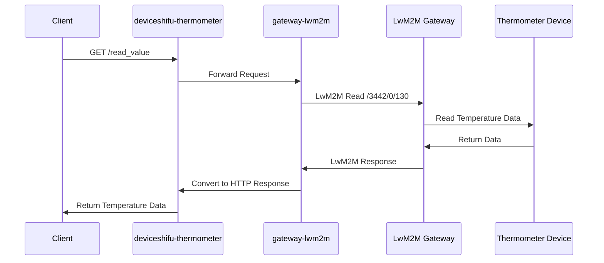

# Connect a HTTP Device Via Gateway

## Gateway Component Introduction

The "Gateway" primarily provides gateway components for establishing communication between edge devices and management systems. This gateway module implements protocol adaptation and conversion, supporting multiple device connections to the Shifu platform. Shifu communicates with the LeShan server through the LwM2M protocol, demonstrating seamless device management and interaction, which is particularly important in edge computing environments with multi-protocol and multi-type IoT devices.

## Pull and Deploy the Shifu Project

Before pulling the project from GitHub, you need to download the relevant Git environment, which can be quickly installed using `yum`.

```shell
sudo yum -y install git
```

Clone Shifu to your local machine:

```shell
git clone https://github.com/Edgenesis/shifu.git
```

Please use the latest configuration file to ensure support for the latest protocols:

```shell
sudo kubectl apply -f pkg/k8s/crd/install/shifu_install.yml
```

## Get the Example and Deploy LwM2M deviceShifu

We'll take connecting a HTTP-based thermometer as an example. Below is the general data flow of our access:



1. First, we deploy the corresponding LwM2M gateway. The code is located in `examples/lwm2m_gw_http/deviceshifu-lwm2m`. Let's deploy them in the cluster.

```bash
kubectl apply -f examples/lwm2m_gw_http/deviceshifu-lwm2m
```

2. Configure the exposed client service and the gateway component for HTTP and LwM2M conversion

```bash
kubectl apply -f examples/lwm2m_gw_http/deviceshifu-thermometer
```

3. Ensure device connection. Our example includes a virtual thermometer device for your testing convenience.

The `kubectl` command allows you to view the status of ***deviceShifu***:

```bash
[root@manager shifu]# kubectl get pods -n deviceshifu
NAME                                                 READY   STATUS    RESTARTS      AGE
deviceshifu-lwm2m-deployment-794ddd9978-z7lcq        1/1     Running   2 (44m ago)   44m
deviceshifu-thermometer-deployment-b98fbbcf8-6g69b   2/2     Running   3 (42m ago)   43m
```

## Running Results

We can check our exposed ports using the following command:

```shell
kubectl get svc -n deviceshifu
```

```shell
[root@manager shifu]# kubectl get svc -n deviceshifu
NAME                        TYPE           CLUSTER-IP     EXTERNAL-IP   PORT(S)                       AGE
deviceshifu-lwm2m-service   NodePort       10.43.47.30    <none>        80:30080/TCP,5683:30000/UDP   47m
deviceshifu-thermometer     LoadBalancer   10.43.64.126   <pending>     80:31703/TCP                  46m
```

As we can see, the external client service port is 31703. Let's test it using curl, apifox, or postman.

```shell
curl http://<your ip>:31703/read_value
```

Test result reference:

```shell
[root@manager shifu]# curl http://192.168.233.10:31703/read_value
19
```