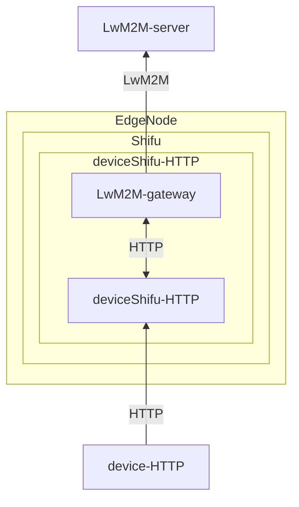

# Connect a HTTP Device via Gateway

## Introduction to LwM2M Gateway

The LwM2M (Lightweight Machine to Machine) Gateway consists of two main components: an LwM2M client that connects to the LwM2M server and an HTTP client that connects to deviceShifu.  The LwM2M Gateway enables deviceShifu to adapt to the LwM2M protocol, handle requests from the LwM2M server, and push data to the cloud, fulfilling the two major functions required by the LwM2M protocol: the capability to pull data from the device and post data from the cloud to the device.

## Get the Example and Deploy LwM2M deviceShifu

We'll demonstrate the integration using an HTTP-based thermometer as an example. You can find the corresponding templates in [lwm2m_gw_http](https://github.com/Edgenesis/shifu/tree/main/examples/lwm2m_gw_http). These templates can be modified to integrate other HTTP protocol devices. To ensure our Gateway operates correctly, we need to modify several configuration files.

### **Configure the edgedevice.yaml**

Before device integration, you need to edit the device's `edgedevice.yaml` file. In this case, we're modifying `lwm2m_gw_http\deviceshifu-thermometer\thermometer-edgedevice.yaml`.

````yaml
...
spec:
  sku: "Thermometer" 
  connection: Ethernet           # Device network connection method
  address: 192.168.1.100:11111   # Device network address
  protocol: HTTP                 # Communication protocol between gateway and device
  gatewaySettings:               # Additional gateway configuration settings
...
````

For `gatewaySettings`, we need to further configure the device [Gateway Configuration for LwM2M-server Integration](https://github.com/Edgenesis/shifu.dev/blob/main/docs/references/api/edgedevice.md).

### **Configure deviceShifu's configmap.yaml**

Before gateway integration, we need to configure the commands that the gateway can receive in **deviceShifu**, along with corresponding instance objects (ObjectId) and data types (DataType). Additionally, we need to configure **deviceShifu** telemetry settings to enable periodic data collection and transmission to the **LwM2M-server**. In this case, we're modifying `deviceshifu-thermometer\deviceshifu-thermometer-configmap.yaml`

````yaml
...
...
  instructions: |
    instructionSettings:
      defaultTimeoutSeconds: 8
    instructions:
      read_value:                  # The name of the command you want to set
        gatewayPropertyList:
          ObjectId: /3442/0/130    # Device instance object ID
          DataType: float          # Data type
  telemetries: |
    telemetries:
      device_health:               # Specify deviceShifu device health monitoring configuration
        properties:
          instruction: get_status
          initialDelayMs: 1000
          intervalMs: 1000
````

### **Configure LwM2M-gateway Settings**

After configuring **deviceShifu**, we need to set up corresponding configurations on the Gateway side. In this case, we're modifying`deviceshifu-lwm2m\lwm2m-deviceshifu-configmap.yaml`

````yaml
...
  instructions: |
    instructions:
      read_value:                  # Corresponding configuration
        protocolPropertyList:
          ObjectId: /3442/0/130
          EnableObserve: false
````

## Deploy LwM2M deviceShifu

We'll take connecting a HTTP-based thermometer as an example. Below is the general data flow of our access:



1. First, we deploy the corresponding LwM2M gateway. The code is located in `examples/lwm2m_gw_http/deviceshifu-lwm2m`. Let's deploy them in the cluster.

```bash
kubectl apply -f examples/lwm2m_gw_http/deviceshifu-lwm2m
```

2. Deploy and run the Device Adapter: deviceShifu-HTTP

```bash
kubectl apply -f examples/lwm2m_gw_http/deviceshifu-thermometer
```

3. Ensure device connection. Our example includes a virtual thermometer device for your testing convenience.

The `kubectl` command allows you to view the status of ***deviceShifu***:

```bash
$ kubectl get pods -n deviceshifu
NAME                                                 READY   STATUS    RESTARTS      AGE
deviceshifu-lwm2m-deployment-794ddd9978-z7lcq        1/1     Running   2 (44m ago)   44m
deviceshifu-thermometer-deployment-b98fbbcf8-6g69b   2/2     Running   3 (42m ago)   43m
```

## Running Results

We can check our service status using the following command:

`````bash
$ kubectl get svc -n deviceshifu
NAME                        TYPE           CLUSTER-IP     EXTERNAL-IP   PORT(S)                       AGE
deviceshifu-lwm2m-service   NodePort       10.43.47.30    <none>        80:30080/TCP,5683:30000/UDP   47m
deviceshifu-thermometer     LoadBalancer   10.43.64.126   <pending>     80:31703/TCP                  46m
`````

We can start an Nginx container and perform a simple test:

`````bash
kubectl exec -it nginx -n deviceshifu -- bash
`````

The following is to get the value through LwM2M-gateway:

`````bash
$ curl deviceshifu-lwm2m-servicece.deviceshifu.svc.cluster.local/read_value
{"bn":"/3442/0/130/","e":[{"v":19}]}
`````
