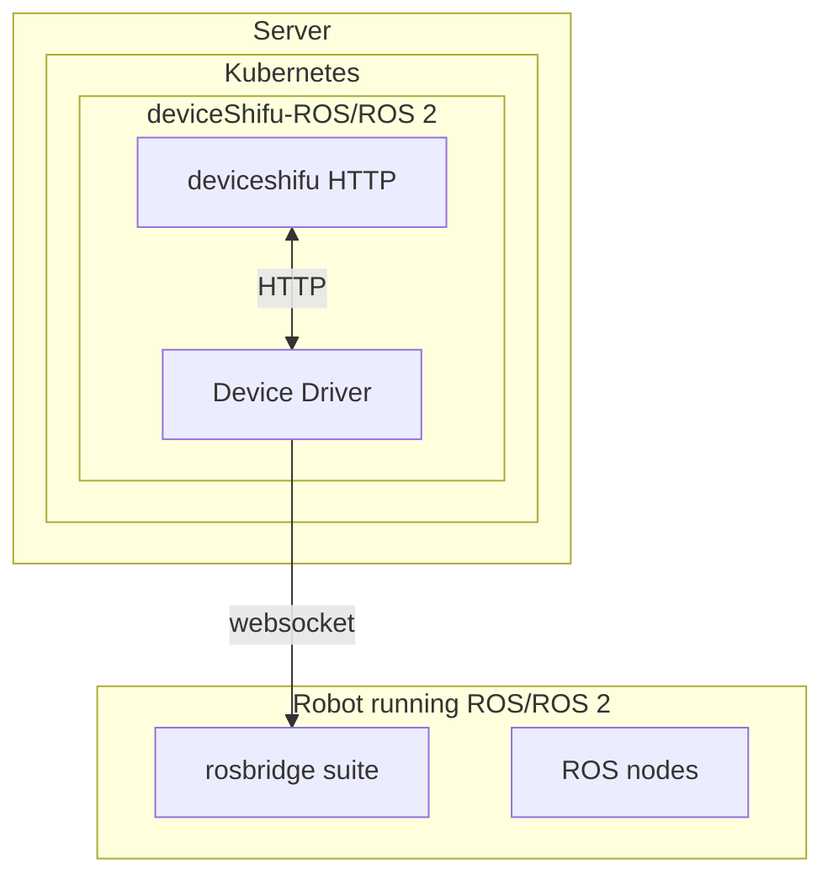

# ROS/ROS 2 Implementation Guide

This guide explains how to deploy a ROS/ROS2 DeviceShifu-based robot device, covering setup, a sample ROS driver, deploying in Shifu and validation.

------

## 1. Architecture Diagram



------

## 2. Prerequisites

### 2.1 Robot

- Ubuntu with ROS/ROS 2 installed
- `rosbridge_server` package

### 2.2 Host (Linux)

- Docker
- k3s
- kubectl

### 2.3 Shifu Installation

Before deploying any ROS device drivers, make sure the Shifu is installed on your edge cluster.

You can install Shifu using the following command :

```bash
kubectl apply -f https://raw.githubusercontent.com/Edgenesis/shifu/v0.70.0/pkg/k8s/crd/install/shifu_install.yml
```

Wait for all Shifu pods to be in the `Running` state:

```bash
kubectl get pods -n shifu-crd-system
```

------

## 3. ROS-side Setup

This example uses a ROS-based robot car.

### 3.1 Install ROS Bridge

```bash
sudo apt-get update
sudo apt-get install ros-noetic-rosbridge-server
# Note: If you are using a different ROS distribution, replace "noetic" in the commands with the corresponding version name.
```

### 3.2 Launch Required Robot Nodes (ROS/ROS 2)

**ROS**

```bash
roscore
source /opt/ros/noetic/setup.bash
roslaunch <your_robot_package> <your_drive_launch_file>.launch
roslaunch <your_robot_package> <your_camera_launch_file>.launch
roslaunch <your_robot_package> <your_lidar_launch_file>.launch
```

**ROS 2**

```bash
source /opt/ros/humble/setup.bash
ros2 launch <your_robot_package> <your_drive_launch_file>.launch
ros2 launch <your_robot_package> <your_camera_launch_file>.launch
ros2 launch <your_robot_package> <your_lidar_launch_file>.launch
```

### 3.3 Launch the rosbridge WebSocket

#### ROS

```bash
roslaunch rosbridge_server rosbridge_websocket.launch
```

#### ROS 2

```bash
ros2 launch rosbridge_server rosbridge_websocket.launch 
```

Note: Make sure each terminal stays open and reports that the node is running.

------

## 4. Write, Package, and Deploy a Custom ROS Driver to k3s

### 4.1 Sample ROS Driver

```go main.go
package main

import (
    "context"
    "encoding/json"
    "log"
    "net/http"
    "os"
    "time"

    "github.com/coder/websocket"
    "github.com/gin-gonic/gin"
)

type ROSMessage struct {
    Op    string      `json:"op"`
    Topic string      `json:"topic"`
    Type  string      `json:"type,omitempty"`
    Msg   interface{} `json:"msg,omitempty"`
}

type Twist struct {
    Linear  Vector3 `json:"linear"`
    Angular Vector3 `json:"angular"`
}

type Vector3 struct {
    X float64 `json:"x"`
    Y float64 `json:"y"`
    Z float64 `json:"z"`
}

var rosConn *websocket.Conn

func connectRosbridge() {
    ctx, cancel := context.WithTimeout(context.Background(), 5*time.Second)
    defer cancel()

    var err error
    rosConn, _, err = websocket.Dial(ctx, "ws://"+os.Getenv("WEBSOCKET_BRIDGE_ADDRESS"), &websocket.DialOptions{
        CompressionMode: websocket.CompressionDisabled,
    })
    if err != nil {
        log.Fatalf("Failed to connect to rosbridge_server: %v", err)
    }
    rosConn.SetReadLimit(20 * 1 << 20)
    log.Println("Connected to rosbridge_server")
}

func publishCmdVel(linear, angular float64) error {
    cmd := ROSMessage{
        Op:    "publish",
        Topic: "/cmd_vel",
        Msg: Twist{
            Linear:  Vector3{X: linear, Y: 0.0, Z: 0.0},
            Angular: Vector3{X: 0.0, Y: 0.0, Z: angular},
        },
    }
    data, _ := json.Marshal(cmd)
    return rosConn.Write(context.Background(), websocket.MessageText, data)
}

func main() {
    connectRosbridge()

    r := gin.Default()

    // Only a single demo API: move forward
    r.POST("/move/forward", func(c *gin.Context) {
        if err := publishCmdVel(0.5, 0); err != nil {
            c.String(http.StatusInternalServerError, "Failed to move forward")
        } else {
            c.String(http.StatusOK, "Moving forward")
        }
    })

    // Listen on port specified by HTTP_PORT env var
    r.Run(":" + os.Getenv("HTTP_PORT"))
}
```

### 4.2 Sample ROS 2 Driver

```go main.go
package main

import (
    "context"
    "log"
    "net/http"
    "os"

    "github.com/gin-gonic/gin"
    "github.com/tiiuae/rclgo/pkg/rclgo"
    geometry_msgs "github.com/tiiuae/rclgo-msgs/geometry_msgs/msg"
)

func main() {
    // Initialize the ROS 2 node
    node, err := rclgo.NewNode("go_cmd_vel_driver", "")
    if err != nil {
        log.Fatalf("Failed to create ROS 2 node: %v", err)
    }
    defer node.Close()

    // Create a publisher for the /cmd_vel topic
    pub, err := node.NewPublisher("/cmd_vel", geometry_msgs.TwistTypeSupport)
    if err != nil {
        log.Fatalf("Failed to create publisher: %v", err)
    }
    defer pub.Close()

    r := gin.Default()

    // Forward movement endpoint
    r.POST("/move/forward", func(c *gin.Context) {
        msg := &geometry_msgs.Twist{}
        msg.Linear.X = 0.5
        msg.Angular.Z = 0.0
        if err := pub.Publish(msg); err != nil {
            c.String(http.StatusInternalServerError, "Failed to move forward")
        } else {
            c.String(http.StatusOK, "Moving forward")
        }
    })

    // Start the ROS 2 executor in a separate goroutine
    go func() {
        rclgo.Spin(context.Background(), node)
    }()

    // Start HTTP server
    port := os.Getenv("HTTP_PORT")
    if port == "" {
        port = "8080"
    }
    r.Run(":" + port)
}
```

------

## 4.3 Build and Push the Docker Image

Create a new `Dockerfile`:

```dockerfile
# Build stage
FROM --platform=$BUILDPLATFORM golang:1.24.1-alpine  as builder

WORKDIR /app

# Copy go.mod and go.sum
COPY go.mod go.sum ./

# Download dependencies
RUN go mod download

# Copy source code
COPY . .

# Build the Go app
ARG TARGETOS
ARG TARGETARCH
RUN CGO_ENABLED=0 GOOS=$TARGETOS GOARCH=$TARGETARCH go build -a -o /output/rosDeviceShifu main.go

# Final stage
# FROM gcr.io/distroless/static-debian11
FROM alpine:latest 

WORKDIR /app

# Copy the binary from builder
COPY --from=builder /output/rosDeviceShifu .

# Expose ROS port
EXPOSE 9090

# Use non-root user for security
USER 65532:65532

# Run the application
ENTRYPOINT ["./rosDeviceShifu"] 
```

**Run the following commands**

**ROS/ROS 2**

```bash
docker build -t <YOUR_REGSTRY>/ros-motion-driver:latest .
docker push <YOUR_REGISTRY>/ros-motion-driver:late
```

------

## 4.4 Create Configuration YAML

### ROS/ROS 2

```yaml myrobot-shifu.yaml
apiVersion: apps/v1
kind: Deployment
metadata:
  name: deviceshifu-ros
  namespace: deviceshifu
  labels:
    app: deviceshifu-ros
spec:
  replicas: 1
  selector:
    matchLabels:
      app: deviceshifu-ros
  template:
    metadata:
      labels:
        app: deviceshifu-ros
    spec:
      serviceAccountName: edgedevice-sa
      volumes:
        - name: deviceshifu-ros
          configMap:
            name: deviceshifu-ros
      containers:
        - image: edgehub/deviceshifu-http-http:v0.70.0
          name: deviceshifu-http
          ports:
            - containerPort: 8080
          volumeMounts:
            - name: deviceshifu-ros
              mountPath: "/etc/edgedevice/config"
              readOnly: true
          env:
            - name: EDGEDEVICE_NAME
              value: "deviceshifu-ros"
            - name: EDGEDEVICE_NAMESPACE
              value: "devices"
        - name: ros1-driver
          image: edgehub/ros-driver:latest    #Replace with your own image name.
          env:
            - name: WEBSOCKET_BRIDGE_ADDRESS
              value: 192.168.31.101:9090      #Enter the actual device IP
            - name: HTTP_PORT
              value: "5001"
          ports:
            - containerPort: 5001
              name: http
---
apiVersion: v1
kind: Service
metadata:
  name: deviceshifu-ros
  namespace: deviceshifu
  labels:
    app: deviceshifu-ros
spec:
  type: ClusterIP
  selector:
    app: deviceshifu-ros
  ports:
    - name: http
      protocol: TCP
      port: 80
      targetPort: 8080
---
apiVersion: shifu.edgenesis.io/v1alpha1
kind: EdgeDevice
metadata:
  name: deviceshifu-ros
  namespace: devices
spec:
  sku: deviceshifu-ros
  protocol: HTTP
  address: localhost:5001
---
apiVersion: v1
kind: ConfigMap
metadata:
  name: deviceshifu-ros
  namespace: deviceshifu
data:
  driverProperties: |
    driverSku: 
    driverImage:
  instructions: |
    instructions:
      move/forward:
  telemetries: |
    telemetrySettings:
```

## 4.5 Deploy the deviceShifu

```bash
kubectl apply -f myrobot-shifu.yaml
```

------

## 5. Expose & Verify

### 5.1 deviceshifu-ros Service Port Forwarding

```bash
kubectl -n deviceshifu port-forward svc/deviceshifu-wheeltec-car-ros1-service 3000:80
```

### 5.2 Test Control and Data Endpoints

```bash
curl http://localhost:3000/move/forward
```