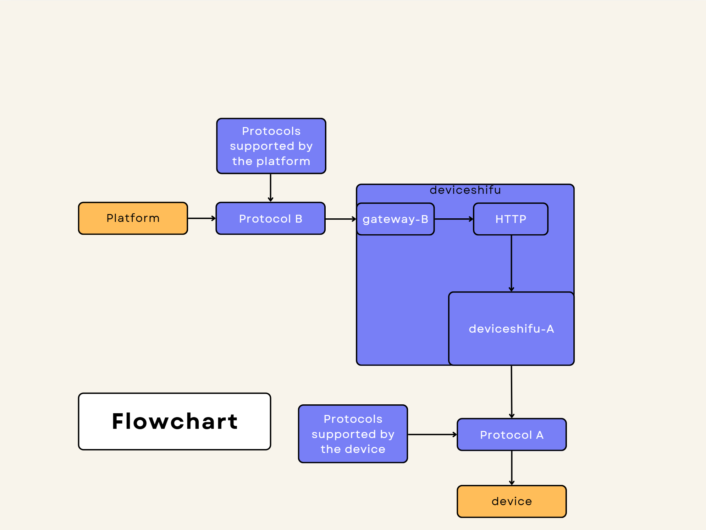

# Gateway General Documentation

## Overview

The gateway serves as a crucial communication bridge in IoT architectures, enabling devices to interact seamlessly with centralized platforms, even when they communicate over different protocols. This document provides a detailed overview of the gateway architecture, components, and data flow, allowing for modular, scalable communication between IoT devices and platforms.

The gateway setup includes two main device interfaces managed by the DeviceShifu modules, with each DeviceShifu handling specific protocols for data transformation. This flexible architecture simplifies the addition of new protocols and allows for efficient management of device data through a central platform.

## Architecture Overview

The architecture comprises the following core components:

1. **Device**: The physical or virtual device that communicates using a specific protocol (Protocol A).
2. **DeviceShifu-A**: A module that interacts with the device using Protocol A. It handles the data conversion to HTTP and prepares it for further processing by the gateway.
3. **Gateway-B**: The main component of the gateway responsible for converting the HTTP data into Protocol B, which the platform can interpret.
4. **Platform**: The target system that receives the data in Protocol B format, enabling processing, storage, or further analysis.

### Data Flow

The data flow across these components follows this pattern:

- **Protocol A**: Device ➔ DeviceShifu-A
- **HTTP**: DeviceShifu-A ➔ Gateway-B
- **Protocol B**: Gateway-B ➔ Platform

### Flowchart

Below is a diagram representing the data flow across the gateway:

## Components in Detail

Each component has a unique function in the data flow from the device to the platform.

### DeviceShifu-A

**Purpose**: DeviceShifu-A acts as the primary interface for devices communicating over Protocol A. It interprets data received from the device and transforms it into a format suitable for HTTP communication.

**Functions**:
1. **Protocol Handling**: DeviceShifu-A is configured to manage Protocol A communication, interacting directly with the device to retrieve data.
2. **Data Formatting**: Upon receiving data, DeviceShifu-A structures it into a JSON payload that can be sent via HTTP.
3. **HTTP Client**: DeviceShifu-A sends the formatted data as an HTTP request to Gateway-B, enabling protocol-independent communication within the gateway.

### Gateway-B

**Purpose**: Gateway-B serves as the intermediary between DeviceShifu-A and the platform. It processes incoming HTTP data, converts it into Protocol B, and sends it to the platform.

**Functions**:
1. **HTTP Server**: Gateway-B operates an HTTP server that listens for incoming requests from DeviceShifu-A. It receives data in JSON format over HTTP.
2. **Protocol Conversion**: After decoding the JSON payload, Gateway-B translates the data to Protocol B format. This step includes any necessary reformatting or encoding changes required by Protocol B.
3. **Data Transmission**: Once the data is in Protocol B format, Gateway-B forwards it to the platform, ensuring compatibility with the platform’s data handling requirements.

### Platform

The platform is the destination for all data processed by the gateway. Once data reaches the platform, it can be stored, analyzed, or otherwise utilized for various applications.

## Communication Workflow

1. **Device to DeviceShifu-A**:
   - The device sends data to DeviceShifu-A using Protocol A.
   - DeviceShifu-A, configured to understand Protocol A, retrieves and interprets the device data.

2. **DeviceShifu-A to Gateway-B**:
   - DeviceShifu-A packages the retrieved data into a JSON format.
   - It sends this JSON data as an HTTP request to Gateway-B for further processing.

3. **Gateway-B to Platform**:
   - Gateway-B receives the HTTP request and decodes the JSON payload.
   - The data is converted from HTTP format to Protocol B.
   - Finally, Gateway-B transmits the data in Protocol B format to the platform, allowing for seamless integration.

## Key Code Functions (From the LwM2M Gateway Code)

The gateway code contains key functions that enable the data handling and protocol transformation required for this architecture.

1. **HTTP Server (Gateway-B)**:
   - Gateway-B sets up an HTTP server to listen for requests from DeviceShifu-A.
   - It handles incoming JSON payloads and prepares them for protocol conversion.

2. **JSON Payload Parsing**:
   - The received JSON data is parsed to extract relevant information.
   - The parsing ensures that all required data points are accurately captured for conversion.

3. **Protocol Conversion**:
   - The core of Gateway-B’s functionality lies in transforming HTTP JSON data into Protocol B.
   - This conversion process involves adapting data formats, message structures, and encoding requirements specific to Protocol B.

4. **Data Transmission to Platform**:
   - After conversion, the data is sent to the platform in Protocol B format.
   - The platform processes the received data as needed, completing the communication loop.

## Advantages of the Gateway Architecture

1. **Modular Design**: The gateway’s modular structure allows for easy integration of new protocols without altering device or platform code.
2. **Scalability**: This architecture supports a large number of devices, enabling efficient data flow management in high-scale IoT deployments.
3. **Protocol Independence**: By abstracting protocol-specific details within DeviceShifu-A and Gateway-B, the gateway provides a flexible solution that adapts to varying communication standards.

## Use Case

This gateway architecture is ideal for IoT systems with heterogeneous device ecosystems where multiple protocols are in use. For instance, in a smart city setting, devices like sensors and cameras may communicate using different protocols, yet their data must be aggregated on a single platform. This gateway setup provides a streamlined, protocol-agnostic way to achieve this, enabling centralized data management and analysis.
