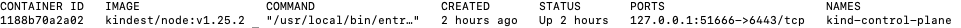
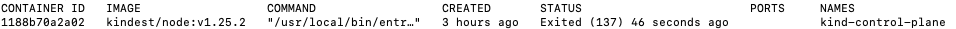
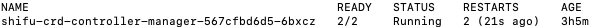

# Update, Uninstall and Restore Demo

## Update ***Shifu*** Demo

:::note
Please uninstall the old version of ***Shifu*** before installing the new version of ***Shifu*** Demo.
:::

Go to [**Shifu** Demo Download](https://shifu.run/disclaimer) to download the latest ***Shifu*** installer.

:::note
***Shifu*** Demo installer will be updated when ***Shifu*** is updated.
:::

## Uninstall ***Shifu*** Demo

Make sure you are currently in the testdir folder.

Use the following command to complete the uninstallation of ***Shifu*** Demo.

```bash
sudo ./test/scripts/deviceshifu-demo-aio_build.sh delete_demo
```

:::caution
This command will uninstall `kind`, `kubectl`, ***Shifu***, ***Shifu*** Demo, ***Shifu*** images and ***Shifu*** Demo folder. Please use it with caution.
:::

## Restore ***Shifu*** Demo

Please make sure your `docker` is running first, if you are not sure whether your `docker` is running or not, please open `Terminal` and execute the following command in the command line:

```bash
sudo docker ps -a
```

If `Docker` is running smoothly, you will get the following output:  


You can check the running status of the kind container with the following command.

```bash
sudo docker ps -a 
```

If you do not see any output, you are not running the kind container, go to [download-install](docs\tutorials\demo-install.md) to install it.

If you see `Status` as `Up`, it means your current `kind` container is running.



If you see `Status` as `Exited`, your current kind container is not running and you can start it with the following command.



```bash
sudo docker start kind-control-plane
```

Next, use the following command to see ***Shifu*** in action.

```bash
sudo kubectl get pod -n shifu-crd-system
```

If you get the following output, i.e. `Status` is `Running`, then ***Shifu*** is running and you can go to [Try it Out](docs\tutorials\demo-try.md) to continue the experience.



If there is no output or your output contains error, i.e. `Status` is `Failed`, then ***Shifu*** is not running or failed to run, you can go to [Download and Install](docs\tutorials\demo-install.md) to install it.
