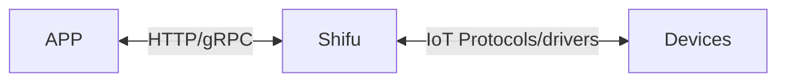

# 欢迎使用 Shifu

***Shifu*** (GitHub 主页：[https://github.com/Edgenesis/shifu](https://github.com/Edgenesis/shifu)) 是一个基于[Kubernetes](https://kubernetes.io/)的物联网开发及管理的开源平台。开发者通过使用***Shifu***，可以更简单地连接、监视和控制任何物联网设备。

**注：*Shifu* 正在开源准备中，如果您有意参与内测，请[点击获取GitHub Repo权限](https://wj.qq.com/s2/10467370/d9ac/)，或与我们进行联系[info@edgenesis.com](mailto:info@edgenesis.com)。**

## 物联网设备

物联网设备是指可以与其他设备、系统、服务进行本地或在线地连接和交流的设备，例如：

- 一个制造厂里的机械臂，它可以接收来自本地的自动化控制系统传来的命令并完成相应的动作。
- 一辆自动导引车，操纵者可对其进行远程控制。
- 一辆汽车上的温度计，它向车载空调发出命令使其升温或降温，并上传实时温度数据到云端。

## 通信

***Shifu*** 与应用、设备之间的关系，可以用下图来表示：

### ***Shifu*** 与设备之间的通信

***Shifu*** 可以同时兼容不同的[通信协议](protocol-driver-compatibility/protocols.md)和[驱动](protocol-driver-compatibility/drivers.md)，它将不同设备的不同形式的请求进行统一，使得用户可以更简单地使用设备。同时，***Shifu*** 对新协议和新驱动的兼容也在持续进行中。

### ***Shifu*** 与应用之间的通信
***Shifu*** 可以通过`HTTP`协议(gRPC协议暂未支持)与开发者所开发的程序进行通信。使得开发者开发物联网设备程序时像开发一个软件一样简单。
换句话说，对设备的控制和信息读取都由 ***Shifu*** 托管并对外暴露成统一类型的接口，只需要使用相同类型的api即可实现对多种类设备的的通信。

## 功能

***Shifu***作为一个对物联网设备进行开发和管理的框架，提供以下功能：

- [***deviceShifu***](https://github.com/Edgenesis/shifu/blob/main/docs/design/design-deviceShifu-zh.md)
  - 从设备获取数据
  - 向设备发送指令
  - 各种应用开发工具(有限状态机等）
- [***shifud***](https://github.com/Edgenesis/shifu/blob/main/docs/design/design-shifud-zh.md)
  - 设备发现
  - 设备验证
  - 设备更新
- [***shifuController***](https://github.com/Edgenesis/shifu/blob/main/docs/design/design-shifuController-zh.md)
  - 管理 ***deviceShifu*** 的生命周期
