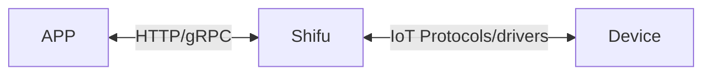

# 欢迎使用 Shifu

***Shifu*** (GitHub 主页：[https://github.com/Edgenesis/shifu](https://github.com/Edgenesis/shifu)) 基于[Kubernetes](https://kubernetes.io/)，是一个与物联网开发、管理相关的开源平台。开发者通过使用***Shifu***，可以更简单地连接、监视和控制任何物联网设备。

**注：***Shifu*** 尚在开源准备中，如读者有意参加内测，请联系[info@edgenesis.com](mailto:info@edgenesis.com)获取GitHub Repo权限！**

## 物联网设备

物联网设备是指可以与其他设备、系统、服务进行在线或本地连接和交流的设备，例如：

- 一个制造厂里的机械臂，它可以接收本地自动化控制系统传来的命令并完成相应的动作。
- 一辆自动导引车，操纵者可对其进行远程控制。
- 一辆汽车上的温度计，它可以命令车载空调升温或降温，并上传实时温度数据到云端。

## 通信

***Shifu*** 可以兼容不同的通信协议和驱动，它将不同设备的不同形式的请求进行统一，使得用户可以更简单地使用设备的功能。

***Shifu*** 与应用、设备之间的关系，可以用下图来表示：

### ***Shifu*** 与设备之间的通信

***Shifu*** 在持续增加可兼容的新协议和新驱动。对于当前可兼容的协议和驱动，参见[兼容协议](protocol-driver-compatibility/protocols.md)和[兼容驱动](protocol-driver-compatibility/drivers.md)。

### ***Shifu*** 与应用之间的通信

***Shifu*** 在持续增加新协议以供用户开发的应用与之进行通信。当前***Shifu***支持与应用进行HTTP（gRPC 暂未支持）通信。

## 功能

***Shifu***作为一个对物联网设备进行开发和管理的框架，提供以下功能：

- [***deviceShifu***](https://github.com/Edgenesis/shifu/blob/main/docs/design/design-deviceShifu-zh.md)
  - 从设备获取数据
  - 向设备发送指令
  - 各种应用开发工具(有限状态机等）
- [***shifud***](https://github.com/Edgenesis/shifu/blob/main/docs/design/design-shifud-zh.md)
  - 设备发现
  - 设备验证
  - 设备更新
- [***shifuController***](https://github.com/Edgenesis/shifu/blob/main/docs/design/design-shifuController-zh.md)
  - 管理 ***deviceShifu*** 的生命周期
