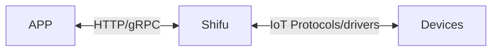

# 架构简介

:::caution正在施工
:::

:::caution正在施工
放一个架构的图片
:::

## 通信

***Shifu*** 与应用、设备之间的关系，可以用下图来表示：

### ***Shifu*** 与设备之间的通信

***Shifu*** 可以同时兼容不同的[通信协议](introduction/support.md)和[驱动](introduction/support.md)，它将不同设备的不同形式的请求进行统一，使得用户可以更简单地使用设备。同时，***Shifu*** 兼容的协议和驱动的数量也在不断增加。

### ***Shifu*** 与应用之间的通信

***Shifu*** 可以通过`HTTP`协议(gRPC协议暂未支持)与开发者所开发的程序进行通信。使得开发者开发物联网场景时像开发一个软件一样简单。

换句话说，对设备的控制和信息读取都由 ***Shifu*** 托管并对外暴露成统一类型的接口，只需要使用相同类型的API即可实现对多种类设备的的通信。
