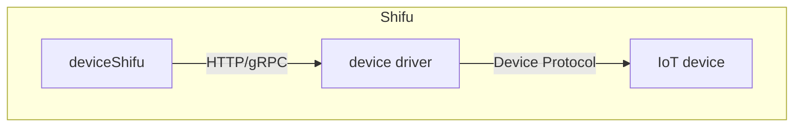

# 驱动

***Shifu***允许用户向平台添加以下形式的驱动:

命令行驱动，请参考[快速上手：调用命令行驱动](../shifu-advanced-functions/remote-driver-execution.md)

## 架构

## 对于未兼容的驱动形式

***Shifu***的微服务架构赋予了 ***Shifu*** 无与伦比的扩展性，也使得 ***Shifu*** 可以非常快速地兼容一个新的驱动。如果您所用的协议 ***Shifu*** 还未支持，请点击[这里](https://github.com/Edgenesis/shifu/issue/new)提交一个GitHub Issue，我们会尽快添加对该协议的支持！
