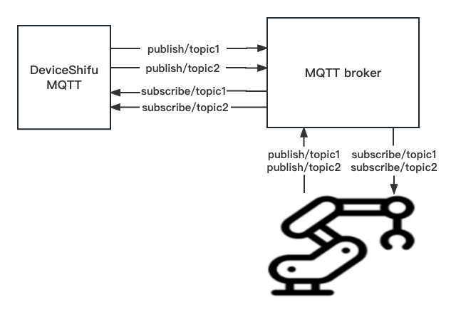
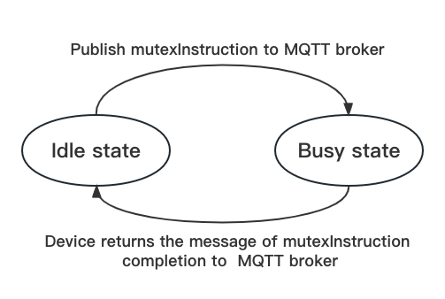

# Implement FSM (finite state machine)

## Introduction

**A finite-state machine (FSM)** or finite-state automaton (FSA, plural: automata), finite automaton, or simply a state machine, is a mathematical model of computation. It is an abstract machine that can be in exactly one of a finite number of states at any given time. The FSM can change from one state to another in response to some inputs; the change from one state to another is called a transition. An FSM is defined by a list of its states, its initial state, and the inputs that trigger each transition.([Please refer to specific introduction on Wiki](https://en.wikipedia.org/wiki/Finite-state_machine))

In engineering, **FSM** can be used to describe the control system of a machine. For example, the control system of a machine may have multiple states, such as "running", "pause", "stop", etc. Each state has different inputs and outputs, and has different transition rules. For example, when the machine is in the "Running" state, receiving the "Pause" input may cause the machine to move to the "Pause" state, while receiving the "Stop" input may cause the machine to stop running.

### Design

Implement the simplest FSM model in MQTT ***DeviceShifu***. The initial state of the device is idle. After using MQTT ***DeviceShifu*** to send control messages (`controlMsg`) to the device, the device transfers from the idle state to the busy state (when the device is in the busy state, other control messages are blocked from receiving); When the device completes the controlMsg, the device returns the completion message to the MQTT Broker, and the device transfers from the busy state to the idle state.





### Functionality

Run the following command in your cluster to send `moving_the_device` controlMsg to the device (we can choose to publish to different topics through different APIs. Here, choose get_topicmsg1 corresponding to topic1), and the device enters the busy state:

```bash
sudo kubectl exec -it nginx -- curl -X POST -d 'moving_the_device' http://deviceshifu-mqtt.deviceshifu.svc.cluster.local/get_topicmsg1  
```

When the device is busy, it will refuse to receive new controlMsgs (including rejecting control messages or ordinary messages sent by other topics, but we can still obtaining device status and other messages through these topics).

Send a new controlMsg when busy:

```bash
sudo kubectl exec -it nginx -- curl -X POST -d 'rotating_the_device' http://deviceshifu-mqtt.deviceshifu.svc.cluster.local/get_topicmsg1
```

​	MQTT **deviceShifu** Return as follows:

```bash
Device is blocked by moving_the_device controlMsg now! 2023-01-02 07:14:28.324501338 +0000 UTC m=+67770.982000572
```

After the device completes the controlMsg, it will send a response to MQTT Broker that the controlMsg is completed, and the idle state will be restored.

Use mosquitto to simulation: completion messages `device_finished_moving` returned by the device

```bash
sudo kubectl exec -it deploy/mosquitto -n devices -- mosquitto_pub -h localhost -d -p 1883 -t /test/test1 -m "device_finish_moving" 
```

At this time, the device has returned to the idle state and can receive other controlMsg or ordinary messages.


### Usage

Customize the device control command `controlMsgs` and their corresponding completion messages as required, configure in the `examples/mqttDeviceShifu/mqtt_deploy/mqtt_edgedevice.yaml` file.

```yml
...
data:
	...
  controlMsgs: | 
  # Optionally, configure controlMsg and corresponding completion message in the format of "key: value". The key is the controlMsg sent to the device through any topic. When the device executes the control command, it enters the busy state and refuses to receive other controlMsgs. The value is the completion message returned by the device, indicating that the device has completed the corresponding controlMsg and recovered the idle state
    Moving_the_device: "Device_finished_moving" # change this row
    Rotating_the_device: "Device_finished_Rotating" 
    ... # You can continue to configure controlMsgs and corresponding completion messages according to your own needs. Just continue to add them in this format
```
