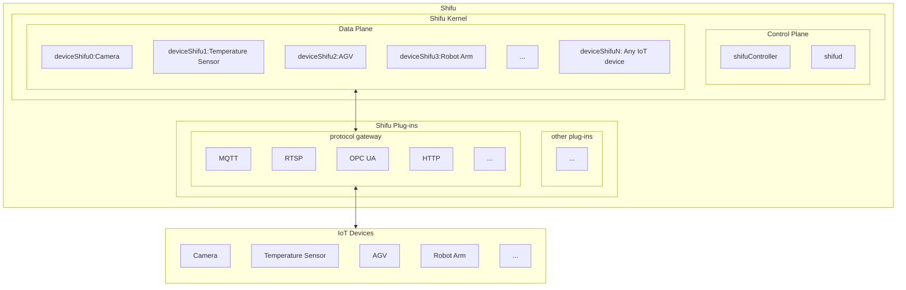
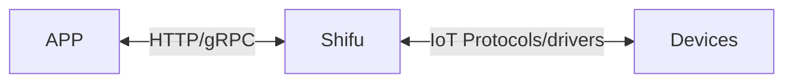

--- 
title: Basic architecture
sidebar_position: 0
--- 

# Basic Architecture

***Shifu*** is a [Kubernetes](https://kubernetes.io/) native platform with all its components running as [Pods](https://kubernetes.io/docs/concepts/workloads/pods/).

This article is an introduction of the ***Shifu*** architecture. If you are interested in the architecture of ***Shifu***, you can go to [desing-shifu](https://github.com/Edgenesis/shifu/blob/main/docs/design/design-shifu.md design-shifu.md) to see the specific details.

The following diagram illustrates the ***Shifu*** architecture.

**Note: The IoT devices within the schematic and the protocols are not limited to the types that appear in the diagram. *Shifu* is extremely scalable and compatible with all IoT devices that communicate via protocols or drivers. **

## Communication

The relationship between ***Shifu*** and applications and devices can be represented by the following diagram.

### Communication with devices

***Shifu*** can be compatible with different communication protocols and drivers at the same time. It unifies different forms of requests from different devices, making it simpler for users to use the devices. Also, the number of protocols and drivers that ***Shifu*** is compatible with continues to grow.

### ***Shifu*** communication with applications

***Shifu*** can communicate with applications developed by developers via the `HTTP` protocol (the gRPC protocol is not yet supported). It makes it as easy as developing a software for developers to develop IoT scenarios.

In other words, the control and information reading of devices are hosted by ***Shifu*** and exposed as a unified type of interface, so that communication to multiple devices can be achieved by using the same type of API.
