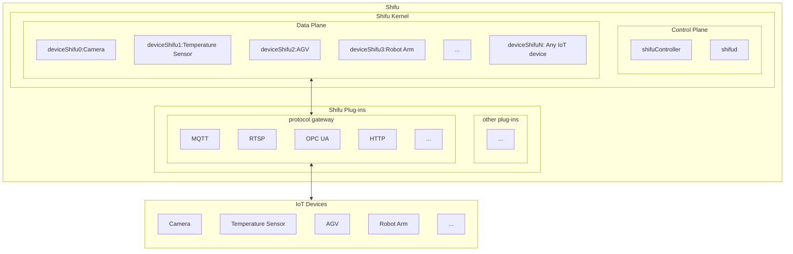
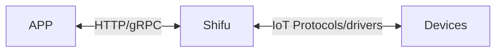

--- 
title: Basic Structure
sidebar_position: 0
--- 

# Basic Structure

***Shifu*** is a native [Kubernetes](https://kubernetes.io/) platform with all its components running as [Pods](https://kubernetes.io/docs/concepts/workloads/pods/).

This article is an introduction to the ***Shifu*** architecture. If you are interested in the architectural design of ***Shifu***, please go to [desing-shifu](https://github.com/Edgenesis/shifu/blob/main/docs/design/design-shifu.md) for the specific details.

The following diagram illustrates the ***Shifu*** architecture：

**Note: IoT devices and protocols within the schematic are not limited to the types that appear in the diagram. ***Shifu*** is extremely scalable and compatible with all IoT devices that interact via protocols or drivers.**

## Interaction

The relationship between ***Shifu*** and applications and devices can be represented by the following diagram:

### Interaction between ***Shifu*** and devices

***Shifu*** is compatible with different communication protocols and drivers all at once, and it unifies different forms of requests from different devices, makes it easier for users to use the devices. Meanwhile, the number of protocols and drivers compatible with ***Shifu*** is growing.

### Interaction between ***Shifu*** and applications

***Shifu*** can interact with applications via `HTTP` protocol (gRPC protocol not yet supported). 

In other words, the control and data collection of devices are hosted by ***Shifu*** and exposed as unified type of interfaces, so that interaction between multiple devices can be achieved by using the same type of APIs.
