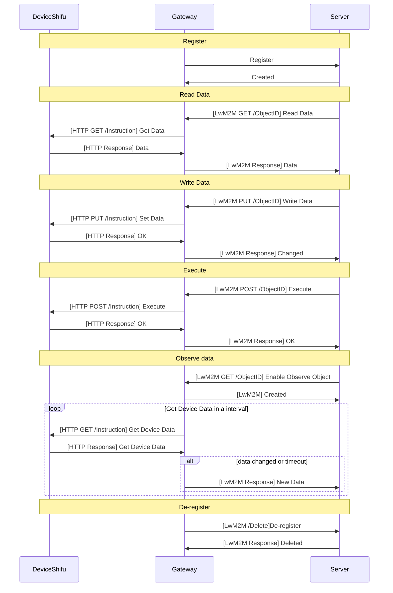

# Gateway General Documentation

The **Shifu** project's gateway is a multi-protocol bridge that supports various protocols such as LwM2M. It provides a unified interaction interface for different IoT devices and systems, simplifying protocol conversion and integration.

## Overview

**Shifu Gateway** obtains all device information from **deviceShifu**. It registers devices with the server and updates device information. **Shifu Gateway** interacts with the server to handle server requests, providing a universal solution for IoT ecosystems. This enables devices using different protocols to be managed and controlled through an integrated gateway, thereby reducing development complexity and facilitating integration with cloud services and other applications.

The gateway component enables devices to adapt to a unified protocol and processes requests from the server. It facilitates data extraction from devices to the server and supports both data publishing and pushing from the cloud to devices.

:::note

Regarding `the server` mentioned above, the server can be understood as the server-side component for the Gateway and serves as a core architectural component responsible for managing and controlling clients. This can be better understood in the context of the LwM2M server discussed below.

:::

## Key Features

- **Device Information Transmission**: Obtains comprehensive device information from **deviceShifu** while managing device registration with the server, and continuously maintains and updates device status and configurations throughout the system lifecycle.
- **Server Integration**: Implements bidirectional communication with the server, efficiently processes incoming server requests, and manages device responses and data transmission in coordination with **deviceShifu**. Support for `Read`, `Write` and `Execute` requests.

- **Data Flow Control**: Orchestrates comprehensive data management by processing data extracted from various protocol devices, supporting cloud-to-device data publishing, enabling device-to-cloud data pushing, and managing cross-system data routing and transformation.

- **IoT Ecosystem Integration**: Delivers a universal connectivity solution that reduces system integration complexity while enabling seamless cloud service integration and facilitating multi-device management across diverse IoT environments.

## Typical Use Case

To support telemetry services for pushing data from devices to data servers, extracting data from devices, or publishing data from the cloud to devices, we need a gateway that enables **deviceShifu** to adapt to the server's protocol, process requests from the server, and push data to the cloud. Below is a typical use case demonstrating how **Shifu Gateway** implements these requirements:

1. Start the client (**Shifu Gateway**) and obtain all device information from **deviceShifu**.
2. Register the device with the server and update the device information.
3. Handle requests from the server.
4. If the server enables the Observe feature, notify the server when data changes or a timeout occurs.
5. Handle read or write requests by calling **deviceShifu** to get or set the data.
6. Before shutting down, deregister from the server and stop the client.
7. If the server disconnects, the gateway will attempt to reconnect and re-register.
8. If a **deviceShifu** instruction times out, the gateway will return an error message to the server.

Let's take the LwM2M server as an example to briefly explain the configuration and the specific process:

**Gateway Configuration**

To connect to the server, the gateway requires configuration details such as the server address, endpoint name, security mode, and PSK key in the EdgeDevice YAML file. The LwM2MSettings are the same as those in the deviceShifu LwM2MSettings.

```yaml
...
spec:
  sku: "LwM2M Device"
  connection: Ethernet
  address: --
  protocol: LwM2M
  protocolSettings:
    LwM2MSetting:
      ...
  gatewaySettings:
    protocol: LwM2M
    address: leshan.eclipseprojects.io:5684
    LwM2MSetting:
      endpointName: LwM2M-device
      securityMode: DTLS
      dtlsMode: PSK
      cipherSuites:
        - TLS_PSK_WITH_AES_128_CCM_8
      pskIdentity: LwM2M-hint
      pskKey: ABC123
```

To map the LwM2M Object and Resource to deviceShifu, we add a `gatewayPropertyList` field for instructions in the deviceShifu ConfigMap. This indicates that the instruction will forward to the LwM2M protocol resource. The ObjectId represents the LwM2M Object Id, and DataType represents the LwM2M Resource Type.

Supported Data Types: `int`, `float`, `string`, `bool`. By default, the data type is `string`.

```yaml
...
data:
  instructions: |
    instructions:
      instruction1:
        gatewayPropertyList:
          ObjectId: 1/0/0
          DataType: int
```



## Advantages

- **Developer-Friendly**: Developers can use familiar tools and frameworks (HTTP, MQTT, LwM2M) to interact with IoT devices, reducing development complexity.
- **Flexible Integration**: The gateway can be easily integrated into existing IoT ecosystems, supporting interoperability with multiple systems and protocols.
- **Unified Management**: By supporting multiple protocols, the gateway provides unified management for different devices and systems, enhancing system scalability.
