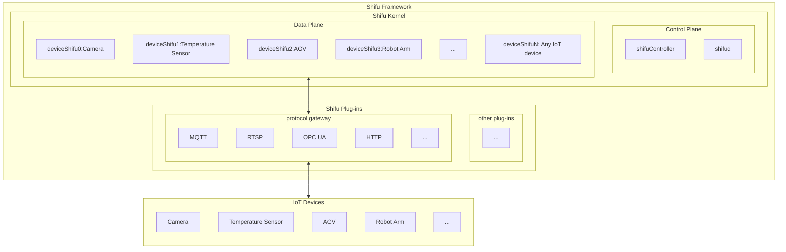

--- 
title: 基本架构
sidebar_position: 1
--- 

# Shifu 基本架构
Shifu是一个[Kubernetes](https://kubernetes.io/)原生的平台，它的所有组件都以[Pod](https://kubernetes.io/docs/concepts/workloads/pods/)的形式运行。

本文是关于Shifu架构的简介，如读者对Shifu的具体架构设计感兴趣，请点击请[点击这里查看](https://github.com/Edgenesis/shifu/blob/main/docs/design/design-shifu-zh.md)。

下图是Shifu架构的示意图：

**注：示意图内的IoT设备以及协议不仅限于图中出现的种类。Shifu具有极强的扩展性，兼容所有通过协议或驱动通信的IoT设备。**