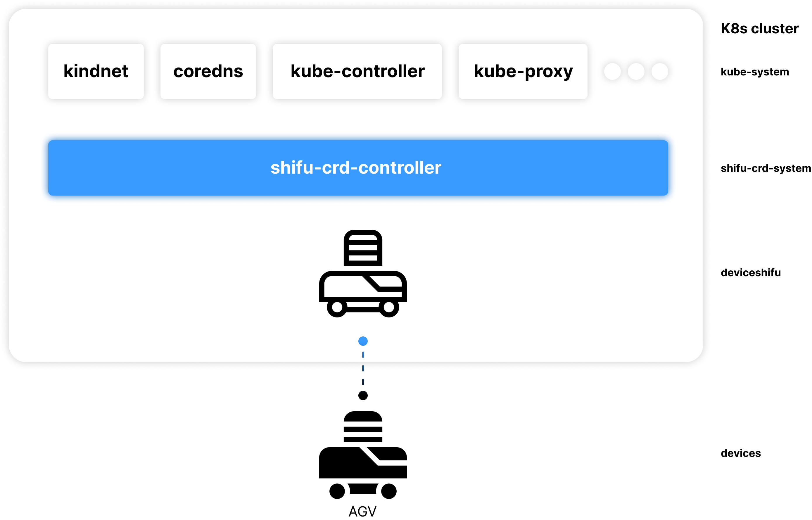

import Tabs from '@theme/Tabs';
import TabItem from '@theme/TabItem';

# Quick install

## Install Docker Desktop

To install and experience ***Shifu*** locally, you need to install `Docker Desktop` first.

:::info
***Shifu*** uses container technology `Docker` to turn every actual physical device (***edgeDevice***) into a digital twin (***deviceShifu***).
:::

Please select your computer OS to see the corresponding `Docker Desktop` installation.

<Tabs groupId="operating-systems">
<TabItem value="win" label="Windows(WSL)">

**0. Install WSL**

:::tip
If you have a `Linux virtual machine` in `VMware` and plan to experience ***Shifu*** in the virtual machine, you can switch to `Linux` by clicking the button above.
:::

Your `Windows` needs to be `Windows 10` (version 2004 and later) or `Windows 11`.

You will need to enter the following command in the administrator `PowerShell` or `Windows Command Prompt` and then **restart your computer** to install everything you need to run the Windows Subsystem (WSL) for Linux.

```
wsl --install
```

If you [encounter problems during setup](https://answers.microsoft.com/en-us/msoffice/forum/all/installation-encountered-a-problem-during-setup/4ad592c9-96b4-49db-8c25-8c144990b7d3), please refer to [the official documentation of WSL](https://docs.microsoft.com/zh-cn/windows/wsl/install).

**1. Install Docker Desktop**

[Click here to download Docker Desktop](https://desktop.docker.com/win/main/amd64/Docker%20Desktop%20Installer.exe)

**2. Open Docker Desktop and keep it running**

**3. Make sure Docker is running smoothly**

Please open `Ubuntu` or other `Linux distribution` you have installed in the start menu and execute the following command:

```bash
sudo docker ps
```

:::note
You may need to enter the administrator password, which will not appear on the screen when you enter it, just hit enter when you are done
:::

</TabItem>
<TabItem value="mac" label="macOS">

**1. Install Docker Desktop**

| Chip | Installer |
|--|--|
| `M1/M2` | [Click here to download installer](https://desktop.docker.com/mac/main/arm64/Docker.dmg) |
| `Intel` | [Click here to download installer](https://desktop.docker.com/mac/main/amd64/Docker.dmg) |

**2. Open Docker Desktop and keep it running**

**3. Make sure Docker is running smoothly**

Please open Terminal and execute the following command:

```bash
sudo docker ps
```

</TabItem>
<TabItem value="linux" label="Linux">

**1. Install Docker Desktop**

[Click here to install Docker Desktop on Linux](https://docs.docker.com/desktop/install/linux-install/)

**2. Open Docker Desktop and keep it running**

**3. Make sure Docker is running smoothly**

Please open Terminal and execute the following command:

```bash
sudo docker ps
```

</TabItem>
</Tabs>

If `Docker` runs successfully, you will see the following output:


If the output is `Cannot connect to the Docker daemon at unix:///var/run/docker.sock. Is the docker daemon running?`, `Docker Desktop` is not started; if the output is `command not found`, `Docker Desktop` is not installed.

## Install ***Shifu***

Go to [**Shifu Demo Download**](https://shifu.run/disclaimer) to download the ***Shifu*** installation package and follow the instructions on the website to install it.

Go directly to the second step in the page and return to this page when you are done.

Or you can install Shifu Demo in the terminal with the following command.
```bash
curl -sfL https://raw.githubusercontent.com/Edgenesis/shifu/main/test/scripts/shifu-demo-install.sh | sudo sh -
```

After the installation is complete ***Shifu*** will be started along with `Docker` when it is run.

:::info
The ***Shifu*** installation package contains the following.

- `kind` for local creation of test clusters
- ***Shifu*** All the images needed for operation
- Installation script for ***Shifu***

You don't need to know the details of how ***Shifu*** works, you can easily experience ***Shifu*** with the ***Shifu*** installer.

If you wish to manually create clusters, import images, and install ***Shifu***, please see the [native test installation](docs\guides\install\install-shifu-dev.md).
:::

:::tip About User Metrics in Shifu
To learn more about user metrics we collect and how to disable it, please check [User Metrics in ***Shifu***](docs\guides\relative-information\user-metrics.md).
:::

### Confirm ***Shifu*** is running

Use the following command to see how it runs.

```bash
sudo kubectl get pods -A
```


If all "STATUS" is `Running`, ***Shifu*** is started:

:::info
The `kubectl get pods -A` command allows you to see all running `Pods` in the cluster (you can simply think of a `Pod` as an application or a process).

You can see that under NAMESPACE `shifu-crd-system`, the controller ***shifuController*** is running; under NAMESPACE `deviceshifu`, there is already an AGV device corresponding to the ***deviceShifu*** digital twin running.
:::



## Next Step

Congratulations you have installed ***Shifu*** on your computer! Next you can go to [Try out](./demo-try.md).
