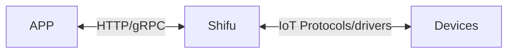

# Welcome to Shifu

***Shifu*** (GitHub homepage: <https://github.com/Edgenesis/shifu>) is an open source platform for IoT development and management based on [Kubernetes](https://kubernetes.io/). By using ***Shifu***, developers can connect, monitor and control any IoT device more easily.

Note: ***Shifu*** is in open source preparation, so if you are interested in participating in the internal testing, please click to [get GitHub Repo access](https://wj.qq.com/s2/10467370/d9ac/), or contact us at [info@edgenesis.com](mailto:info@edgenesis.com).

## IoT Devices

An IoT device is a device that can connect and interact with other devices, systems, and applications offline or online, for instance:

- A robotic arm in a manufacturing plant that can receive commands from a local automated control system and complete the corresponding moves.
- An automated guided vehicle that can be remotely controlled by its operator.
- A thermometer in a car that can send commands to the on-board air conditioner to raise or lower its temperature, and can upload real-time temperature data to the cloud.

## Interaction

The relationship between ***Shifu*** and applications and devices can be represented by the following diagram:

### Interaction between ***Shifu*** and devices

***Shifu*** is compatible with different [communication protocols](protocol-driver-compatibility/protocols.md) and [drivers](protocol-driver-compatibility/drivers.md) all at once, and it unifies different forms of requests from different devices, making it easier to use the devices. Simultaneosly, the number of protocols and drivers compatible with ***Shifu*** is increasing.

### Interaction between ***Shifu*** and applications

***Shifu*** can interact with applications developed via `HTTP` protocol (gRPC protocol not yet supported). With ***Shifu***, developing IoT scenarios is as easy as developing software. In other words, the control and information reading of devices are hosted by Shifu and exposed as a unified type of interface, so that interaction between multiple devices can be achieved by using the same type of api.

## Features

***Shifu***, as a framework for developing and managing IoT devices, features the following functions：

- [***deviceShifu***](https://github.com/Edgenesis/shifu/blob/main/docs/design/design-deviceShifu.md)
  - Get data from devices
  - Send commands to the devices
  - Various application development tools (finite state machine, etc.)
- [***shifud***](https://github.com/Edgenesis/shifu/blob/main/docs/design/design-shifud.md)
  - Device discovery
  - Device verification
  - Device update
- [***shifuController***](https://github.com/Edgenesis/shifu/blob/main/docs/design/design-shifuController.md)
  - Managing the ***deviceShifu*** lifecycle
