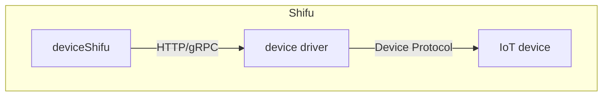

# Driver

***Shifu*** allows users to add the drivers to platform as follows: Command line drivers.

please refer to [Quick Start: Invoking Command Line Drivers]((shifu-advanced-functions/remote-driver-execution.md))

## Framework

## About incompatible driver forms

***Shifu***'s microservices architecture empowers ***Shifu*** with unparalleled scalability and allows ***Shifu*** to be compatible with new drivers quickly. 

If the driver used is not yet supported by ***Shifu***, please click [here](https://github.com/Edgenesis/shifu/issues/new) to submit a [GitHub Issue](https://github.com/Edgenesis/shifu/issues) and we will support it ASAP!
