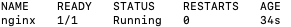
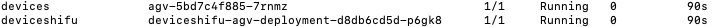
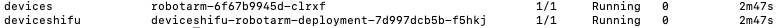

## Start the Nginx

Start with an instance of nginx to simulate an application's interaction with Shifu:

```bash
sudo kubectl run --image=nginx:1.21 nginx
sudo kubectl get pods -A | grep nginx
```

Now, nginx is in operation:



## Interact with Digital Twin Devices

We have prepared five virtual devices (AGV, thermometer, microplate reader, PCL and robotic arm) for you to explore the abilities of *Shifu*.

### 1.Interact with a digital twin of the AGV

<details>
  <summary> Click here to view the details of AGV  </summary>
  Q: What is AGV?  <br/>
  A: AGV is an automatic guided vehicle, please click <a href="https://en.wikipedia.org/wiki/Automated_guided_vehicle">here</a> for details. <br/>
  Q: How to simulate AGV in this demo? <br/>
  A: When the simulated AGV receives the get_position command, it will generate and return the x and y coordinates of the current position of the device.
</details>

#### Start the virtual AGV device

First, create a digital twin of the AGV: (if you have just installed `Shifu` through the `Shifu installer`, it will automatically create an `AGV` digital twin, so you do not need to go through the following creation process, please jump directly to [interacting with the AGV virtual appliance](#interact-with-the-virtual-agv-device))

```bash
sudo kubectl apply -f run_dir/shifu/demo_device/edgedevice-agv
```

The AGV has started normally:

```bash
sudo kubectl get pods -A | grep agv
```



#### Interact with the virtual AGV device

First, please enter nginx: (if you have not started Nginx, please [start the Nginx service](#start-the-nginx) first)

```bash
sudo kubectl exec -it nginx -- bash
```

By communicating with the digital twin of the AGV via `http://deviceshifu-agv.deviceshifu.svc.cluster.local`, Shifu can get the x and y coordinates of the current position of the AGV:

```bash
curl http://deviceshifu-agv.deviceshifu.svc.cluster.local/get_position; echo
```


### 2. Interact with a digital twin of the thermometer

<details>
  <summary> Click here for thermometer details </summary>
  Q: How do I simulate a thermometer in this demo? <br/>
  A: When the simulated thermometer receives the read_value command it will generate and return the current thermometer reading.
</details>

#### Start the Virtual Thermometer Device

First, create a digital twin of the thermometer:

```bash
sudo kubectl apply -f run_dir/shifu/demo_device/edgedevice-thermometer
```

Now, the thermometer has started normally:

```bash
sudo kubectl get pods -A | grep thermometer
```


#### Interact with the virtual thermometer device

Next, enter nginx to test the thermometer: (if you have not started Nginx, please [start the Nginx service](#start-the-nginx) first)

```bash
sudo kubectl exec -it nginx -- bash
```

By communicating with the digital twin of the thermometer via `http://deviceshifu-thermometer.deviceshifu.svc.cluster.local`, Shifu can get the measured temperature of the thermometer (the following results are random):

```bash
curl http://deviceshifu-thermometer.deviceshifu.svc.cluster.local/read_value; echo
```


Finally, the current operating status of the thermometer can be obtained through the `get_status` command (the following results are random):

```bash
curl http://deviceshifu-thermometer.deviceshifu.svc.cluster.local/get_status; echo
```


```bash
curl http://deviceshifu-thermometer.deviceshifu.svc.cluster.local/get_status; echo
```


### 3. Interact with a digital twin of the microplate reader

<details>
  <summary> Click here to view the details of the microplate reader  </summary>
  Q: What is the microplate reader? <br/>
  A: The microplate reader is a kind of laboratory equipment, please click <a href="https://en.wikipedia.org/wiki/Plate_reader">here</a> for the specific introduction. <br/>
  Q: How to simulate the microplate reader in this demo? <br/>
  A: When the simulated microplate reader receives the command get_measurement, it will return an 8*12 matrix, each number in it represents the result value of the spectral analysis scan in a sample.
</details>

#### Start the virtual microplate reader device

First, start the digital twin of the microplate reader:

```
sudo kubectl apply -f run_dir/shifu/demo_device/edgedevice-plate-reader
```

Enter the following command to see that the digital twin of the microplate reader has been started:

```bash
sudo kubectl get pods -A | grep plate
```


#### Interact with the virtual microplate reader device

Next, enter nginx: (if you have not started Nginx, please [start the Nginx service](#start-the-nginx) first)

```
sudo kubectl exec -it nginx -- bash
```

By communicating with the digital twin of the microplate readerr via `http://deviceshifu-thermometer.deviceshifu.svc.cluster.local`, Shifu can get the results of the microplate reader：

```bash
curl "deviceshifu-plate-reader.deviceshifu.svc.cluster.local/get_measurement"
```


### 4. Interact with a digital twin of the PLC

<details>
  <summary> Click here to view PLC details  </summary>
  Q: What is PLC? <br/>
  A: PLC is a very common industrial controller, please click <a href="https://en.wikipedia.org/wiki/Programmable_logic_controller">here</a> for details. <br/>
  Q: How to simulate PLC in this demo? <br/>
  A: When the simulated PLC receives the sendsinglebit command, it can modify a bit in the memory area, and when it receives the getcontent command, it can get the value of a byte in the memory area.
</details>

#### Start the virtual PLC device

First, start the digital twin of the PLC:

```bash
sudo kubectl apply -f run_dir/shifu/demo_device/edgedevice-plc
```

Enter the following command to see that the digital twin of the PLC has been started:

```bash
sudo kubectl get pods -A | grep plc
```


#### Interact with virtual PLC devices

Next, please enter nginx: (if you have not started Nginx, please [start the Nginx service](#start-the-nginx) first)

```bash
sudo kubectl exec -it nginx -- bash
```

By communicating with the PLC digital twin via `http://deviceshifu-plc.deviceshifu.svc.cluster.local`, Shifu can set bit 0 of the `Q0` memory area of ​​the PLC to 1:

```bash
curl "deviceshifu-plc.deviceshifu.svc.cluster.local/sendsinglebit?rootaddress=Q&address=0&start=0&digit=0&value=1"; echo
```


"digit" indicates the number of bits in the PLC memory, "value" indicates the value of the current bit, and the value of the corresponding memory area bit can be changed by modifying the values ​​of "digit" and "value". For example, the fourth digit value of the Q0 memory of a PLC represents the control program, and the program can be started by setting "digit=3" and "value=1":

```bash
curl "deviceshifu-plc.deviceshifu.svc.cluster.local/sendsinglebit?rootaddress=Q&address=0&start=0&digit=3&value=1"; echo
```


### 5. Interact with a digital twin of the robotic arm

<details>
  <summary> Click here to view the details of the robotic arm </summary>
  Q: What is a robotic arm? <br/>
  A: The robotic arm is a very common industrial controller, please click <a href="https://en.wikipedia.org/wiki/Robotic_arm">here</a> for details. <br/>
  Q: How to simulate the robotic arm in this demo? <br/>
  A: When the simulated robotic arm receives the get_coordinate command, it will return its current x, y, z axis coordinates.
</details>

#### Start the virtual robot arm device

First, create a digital twin of the robotic arm:

```bash
sudo kubectl apply -f run_dir/shifu/demo_device/edgedevice-robot-arm
```

Enter the following command to see that the digital twin of the robotic arm has been started:

```bash
sudo kubectl get pods -A | grep robotarm
```



#### Interact with the virtual robotic arm device

Next, enter nginx: (if you have not started Nginx, please [start the Nginx service](#start-the-nginx) first)

```bash
sudo kubectl exec -it nginx -- bash
```

By communicating with the digital twin of the robotic arm through `http://deviceshifu-robotarm.deviceshifu.svc.cluster.local`, Shifu can get the coordinates and operating states of the robotic arm (the following operating states appear randomly):

```bash
curl http://deviceshifu-robotarm.deviceshifu.svc.cluster.local/get_coordinate; echo
```


```bash
curl http://deviceshifu-robotarm.deviceshifu.svc.cluster.local/get_status; echo
```


```bash
curl http://deviceshifu-robotarm.deviceshifu.svc.cluster.local/get_status; echo
```


```bash
curl http://deviceshifu-robotarm.deviceshifu.svc.cluster.local/get_status; echo
```


Congratulations! ! !  :rocket: :rocket: :rocket: You have completed the installation and demos of Shifu, now you can explore freely! If you are interested, you can click here to visit our [GitHub](github.md) home page!
