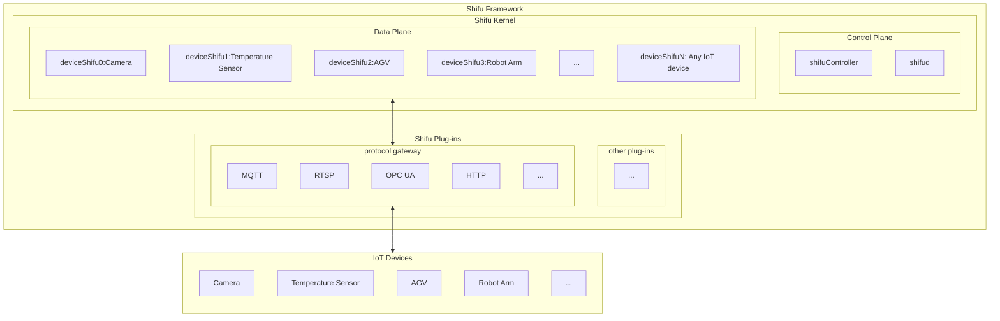

--- 
title: Basic Structure
sidebar_position: 0
--- 

# Basic Structure

***Shifu*** is a [Kubernetes](https://kubernetes.io/) platform with all its components running as [Pods](https://kubernetes.io/docs/concepts/workloads/pods/).

This article is an introduction to the ***Shifu*** architecture. If you are interested in the architectural design of ***Shifu***, please go to [desing-shifu](https://github.com/Edgenesis/shifu/blob/main/docs/design/design-shifu.md) for the specific details.

The following diagram illustrates the ***Shifu*** architecture：

**Note: IoT devices and protocols within the schematic are not limited to the types that appear in the diagram. ***Shifu*** is extremely scalable and compatible with all IoT devices that interact via protocols or drivers.**
