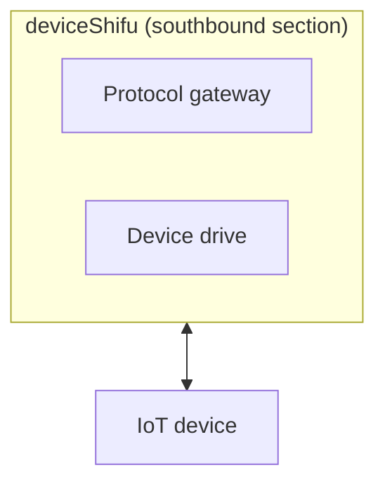
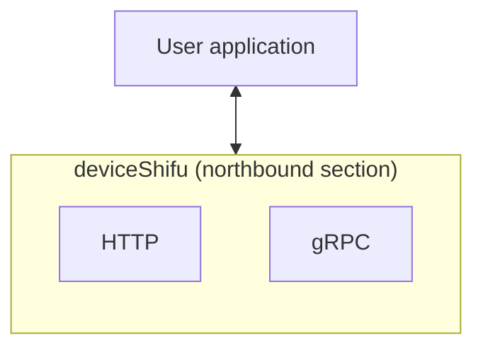

The main component of the Shifu data plane is `deviceShifu`.

### deviceShifu

#### Introduction

`deviceShifu` is the core of Shifu Framework and the part that developers care about the most. `deviceShifu` takes the form of a Kubernetes Pod, a `digital representation` or `digital twin` of a physical device.

Each `deviceShifu` is associated with one or more physical devices. Users can interact with physical devices by interacting with `deviceShifu`.

**Southbound** - `deviceShifu` interacts with IoT devices, translating and sending user requests to the device through a protocol gateway or device driver.

**Northbound** - `deviceShifu` converts the collected device data via HTTP protocol (gRPC protocol is not supported yet) and sends it to the client.

#### Design Docs

If you are interested in the detailed implementations of `deviceShifu`, you can visit the [deviceShifu design documentation](https://github.com/Edgenesis/shifu/blob/main/docs/design/design-deviceShifu.md) for further reading.
