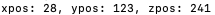

# Try it Out

We have prepared five devices (AGV, thermometer, microplate reader, PCL and robotic arm) in ***Shifu*** installer for you to explore the abilities of ***Shifu***.

:::note
An IoT device is a device that can connect and interact with other devices, systems, and applications offline or online, for instance:

- A robotic arm in a manufacturing plant that can receive commands from a local automated control system and complete the corresponding moves.
- An automated guided vehicle that can be remotely controlled by its operator.
- A thermometer in a car that can send commands to the on-board air conditioner to raise or lower its temperature, and can upload real-time temperature data to the cloud.

When installing ***Shifu*** installer, five virtual devices are created and connected to your computer. These virtual devices have the same functions with actual IoT devices.
:::

## Preparation

Start an instance of `nginx` to interact with ***deviceShifu***:

```bash
sudo kubectl run --image=nginx:1.21 nginx
sudo kubectl get pods -A | grep nginx
```

Now, `nginx` is running:


:::note
In a real-world scenario, users of IoT devices use an application or a monitoring platform to interact with the digital twin ***deviceShifu***. Here `nginx` is equivalent to an application or a monitoring platform.
:::

## 1.Interact with the AGV

<details>
  <summary> Click here to view the details of AGV  </summary>
  Q: What is AGV?  <br/>
  A: AGV is an automatic guided vehicle, please click <a href="https://en.wikipedia.org/wiki/Automated_guided_vehicle">here</a> for details. <br/>
  Q: How to interact with the AGV in this demo? <br/>
  A: When the digital twin of the AGV receives the get_position command, it will generate and return the x and y coordinates of the current position of the device.
</details>

### Create the digital twin

:::note
You have just installed ***Shifu*** through the ***Shifu*** installer, and the digital twin of the AGV, ***deviceShifu***, has been created automatically. So you can interact with the digital twin of the AGV directly without having to go through the manual creation process.

The state of the digital twin will be the same as the state of the actual device, and interacting with the digital twin is equivalent to interacting with the actual IoT device.
:::

Execute the following command, and we can see the digital twin of the AGV has started normally:

```bash
sudo kubectl get pods -A | grep agv
```


:::caution Work in Progress
Image same as the image in install-demo
:::

### Interact with the digital twin

Next, enter the `nginx`:

```bash
sudo kubectl exec -it nginx -- bash
```

By communicating with the digital twin of the AGV via `http://deviceshifu-agv.deviceshifu.svc.cluster.local`, Shifu can get the `x` and `y` coordinates of the current position of the AGV:

```bash
curl http://deviceshifu-agv.deviceshifu.svc.cluster.local/get_position; echo
```


:::note
Press `ctrl D` to exit `nginx`.
:::

## 2. Interact with the thermometer

<details>
  <summary> Click here for thermometer details </summary>
  Q: How do I interact with a thermometer in this demo? <br/>
  A: When the digital twin of the thermometer receives the read_value command it will generate and return the current thermometer reading.
</details>

### Create the digital twin

First, create a digital twin of the thermometer:

```bash
sudo kubectl apply -f run_dir/shifu/demo_device/edgedevice-thermometer
```

Now, the thermometer has started normally:

```bash
sudo kubectl get pods -A | grep thermometer
```


:::caution Work in Progress
Image above + new device
:::

### Interact with the digital twin

Next, enter the `nginx`:

```bash
sudo kubectl exec -it nginx -- bash
```

By communicating with the digital twin of the thermometer via `http://deviceshifu-thermometer.deviceshifu.svc.cluster.local`, Shifu can get the measured temperature of the thermometer (the following results are random):

```bash
curl http://deviceshifu-thermometer.deviceshifu.svc.cluster.local/read_value; echo
```


Finally, the current operating status of the thermometer can be obtained through the `get_status` command (the following results are random):

```bash
curl http://deviceshifu-thermometer.deviceshifu.svc.cluster.local/get_status; echo
```


```bash
curl http://deviceshifu-thermometer.deviceshifu.svc.cluster.local/get_status; echo
```


:::note
Press `ctrl D` to exit `nginx`.
:::

## 3. Interact with the microplate reader

<details>
  <summary> Click here to view the details of the microplate reader  </summary>
  Q: What is the microplate reader? <br/>
  A: The microplate reader is a kind of laboratory equipment, please click <a href="https://en.wikipedia.org/wiki/Plate_reader">here</a> for the specific introduction. <br/>
  Q: How to interact with the microplate reader in this demo? <br/>
  A: When the digital twin of the microplate reader receives the command get_measurement, it will return an 8*12 matrix, each number in it represents the result value of the spectral analysis scan in a sample.
</details>

### Create the digital twin

First, start the digital twin of the microplate reader:

```
sudo kubectl apply -f run_dir/shifu/demo_device/edgedevice-plate-reader
```

Enter the following command to see that the digital twin of the microplate reader has been started:

```bash
sudo kubectl get pods -A | grep plate
```


:::caution Work in Progress
Image above + new device
:::

### Interact with the digital twin

Next, enter nginx: (if you have not started Nginx, please [start the Nginx service](#start-the-nginx) first)

```
sudo kubectl exec -it nginx -- bash
```

By communicating with the digital twin of the microplate readerr via `http://deviceshifu-thermometer.deviceshifu.svc.cluster.local`, Shifu can get the results of the microplate reader：

```bash
curl "deviceshifu-plate-reader.deviceshifu.svc.cluster.local/get_measurement"
```


:::note
Press `ctrl D` to exit `nginx`.
:::

## 4. Interact with the PLC

<details>
  <summary> Click here to view PLC details  </summary>
  Q: What is PLC? <br/>
  A: PLC is a very common industrial controller, please click <a href="https://en.wikipedia.org/wiki/Programmable_logic_controller">here</a> for details. <br/>
  Q: How to interact with the PLC in this demo? <br/>
  A: When the digital twin of the PLC receives the sendsinglebit command, it can modify a bit in the memory area, and when it receives the getcontent command, it can get the value of a byte in the memory area.
</details>

### Create the digital twin

First, start the digital twin of the PLC:

```bash
sudo kubectl apply -f run_dir/shifu/demo_device/edgedevice-plc
```

Enter the following command to see that the digital twin of the PLC has been started:

```bash
sudo kubectl get pods -A | grep plc
```


:::caution Work in Progress
Image above + new device
:::

### Interact with the digital twin

Next, please enter nginx: (if you have not started Nginx, please [start the Nginx service](#start-the-nginx) first)

```bash
sudo kubectl exec -it nginx -- bash
```

By communicating with the PLC digital twin via `http://deviceshifu-plc.deviceshifu.svc.cluster.local`, Shifu can set bit 0 of the `Q0` memory area of ​​the PLC to 1:

```bash
curl "deviceshifu-plc.deviceshifu.svc.cluster.local/sendsinglebit?rootaddress=Q&address=0&start=0&digit=0&value=1"; echo
```


"digit" indicates the number of bits in the PLC memory, "value" indicates the value of the current bit, and the value of the corresponding memory area bit can be changed by modifying the values ​​of "digit" and "value". For example, the fourth digit value of the Q0 memory of a PLC represents the control program, and the program can be started by setting "digit=3" and "value=1":

```bash
curl "deviceshifu-plc.deviceshifu.svc.cluster.local/sendsinglebit?rootaddress=Q&address=0&start=0&digit=3&value=1"; echo
```


:::note
Press `ctrl D` to exit `nginx`.
:::

## 5. Interact with the robotic arm

<details>
  <summary> Click here to view the details of the robotic arm </summary>
  Q: What is a robotic arm? <br/>
  A: The robotic arm is a very common industrial controller, please click <a href="https://en.wikipedia.org/wiki/Robotic_arm">here</a> for details. <br/>
  Q: How to interact with the robotic arm in this demo? <br/>
  A: When the digital twin of the robotic arm receives the get_coordinate command, it will return its current x, y, z axis coordinates.
</details>

### Create the digital twin

First, create a digital twin of the robotic arm:

```bash
sudo kubectl apply -f run_dir/shifu/demo_device/edgedevice-robot-arm
```

Enter the following command to see that the digital twin of the robotic arm has been started:

```bash
sudo kubectl get pods -A | grep robotarm
```


:::caution Work in Progress
Image above + new device
:::

### Interact with the digital twin

Next, enter nginx: 

```bash
sudo kubectl exec -it nginx -- bash
```

By communicating with the digital twin of the robotic arm through `http://deviceshifu-robotarm.deviceshifu.svc.cluster.local`, Shifu can get the coordinates and operating states of the robotic arm (the following operating states appear randomly):

```bash
curl http://deviceshifu-robotarm.deviceshifu.svc.cluster.local/get_coordinate; echo
```



```bash
curl http://deviceshifu-robotarm.deviceshifu.svc.cluster.local/get_status; echo
```


```bash
curl http://deviceshifu-robotarm.deviceshifu.svc.cluster.local/get_status; echo
```


```bash
curl http://deviceshifu-robotarm.deviceshifu.svc.cluster.local/get_status; echo
```


Congratulations! ! !  :rocket: :rocket: :rocket: You have completed the installation and demos of Shifu, now you can explore freely!

If you are interested, you can visit the [GitHub repository of ***Shifu***](https://github.com/Edgenesis/shifu).

:::note
Press `ctrl D` to exit `nginx`.
:::

## Next Step

Congratulations！！！:rocket: :rocket: :rocket: You have completed trying ***Shifu***, next:

- You can check the left sidebar for 
    - [**How-to Guides**](./guides/): Detailed guides for using ***Shifu***.
    - [**Reference Book**](./references/)
        - ***Shifu*** architecture and functions.
        - ***Shifu*** API reference.
    - [**Open Source Community**](./community/): View common problems, get support, and join the open source community.
- ***Shifu*** is now an open source project. If you are interested in it, visit ***Shifu***'s repo at [GitHub](https://github.com/Edgenesis/shifu).
- [Contact us to get technical support](community/join.md)。

## Delete the cluster (optional)

During the process of trying ***Shifu***, the ***Shifu*** installer created a cluster on your computer and installed ***Shifu*** in this cluster. If you do not want this cluster to run continuously, you can delete this cluster by executing the following command:

```bash
sudo kind delete cluster
```

`Docker` images can also be deleted. Use command `sudo docker images` to check all images. You can use command `sudo docker rmi <image_id>` to delete useless images.

:::info
Used images:

- `kindest/node` to create a local cluster
- `edgehub/deviceshifu-http-xxxx` to generate a ***deviceShifu*** on the base of it
- `edgehub/mockdevice-xxx` virtual devices
- `edgehub/shifu-controller-telemetry-plugin` a ***Shifu*** plug-in
- `edgehub/shifu-controller` `edgehub/edgedevice-controller-multi` ***Shifu***'s controller
- `nginx` to interact with ***deviceShifu***
:::

Delete the downloaded ***Shifu*** installer `shifu_demo_aio_xxx_xxx.tar` and the folder `testdir`.
