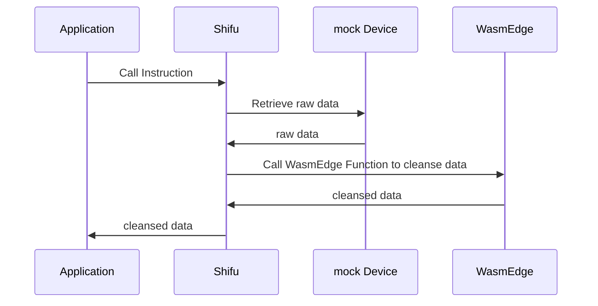

# Integrate WasmEdge in Shifu to Cleanse Data

本文将简单介绍如何将 `WasmEdge` 集成到 ***Shifu*** 中，从而实现从IoT设备上采集的数据的清洗。

## 背景 🌇

当我们在使用 ***Shifu*** 采集数据的时候，通常会出现从设备所采集到的数据，与我们所需要的数据格式不同的情况。为解决此问题，我们可以使用 ***Shifu*** + `WasmEdge` 实现把 ***Shifu*** 采集到的数据通过 `WasmEdge` 进行处理后再返回给我们的应用程序。

以下为简单逻辑：



:::tip `WasmEdge` 简介 🏬

`WasmEdge` 是一个轻量级高性能 `WebAssembly(WASM)` 虚拟机，为边缘进行了优化。`WasmEdge` 可以应用于severless云函数、SaaS、区块链智能合约、物联网、汽车实时软件应用等多种场景。
:::

## 准备 🗂

1. `kubectl` v1.24.2
2. `docker` 20.10.16
3. `kind` v0.14.0
4. `git` 2.36.1

## 部署 🔨

为了方便您更快的了解本篇文章，您可以通过以下命令从Github上下载程序。🚀

```bash 
git clone https://github.com/Edgenesis/wasm-shifu-demo.git
cd wasm-shifu-demo
```

### 创建k8s集群 🐝

使用以下命令创建 `k8s` 集群。

```bash
$ kind delete cluster && kind create cluster
Creating cluster "kind" ...
 ✓ Ensuring node image (kindest/node:v1.24.0) 🖼
 ✓ Preparing nodes 📦  
 ✓ Writing configuration 📜 
 ✓ Starting control-plane 🕹️ 
 ✓ Installing CNI 🔌 
 ✓ Installing StorageClass 💾 
Set kubectl context to "kind-kind"
You can now use your cluster with:
kubectl cluster-info --context kind-kind
Have a question, bug, or feature request? Let us know! https://kind.sigs.k8s.io/#community 🙂
```

### 构建Shifu镜像  🪞

构建 ***Shifu*** 镜像。

```bash
$ make -f shifu/Makefile build-image-deviceshifu
$ kind load docker-image edgehub/deviceshifu-http-http:v0.0.6
$ docker images | grep edgehub/deviceshifu-http-http 
edgehub/deviceshifu-http-http                v0.0.6    1d6b3544b8ad   54 minutes ago   36.1MB
```

### 运行虚拟设备 🔌

为了方便您的体验，这里我们使用虚拟设备进行模拟。 

安装并运行虚拟设备，设备的端口号为`8099`。

```bash
$ docker build -f mockDevice/dockerfile -t mockdevice:v0.0.1 .
$ docker run -p 8099:8099 -itd mockdevice:v0.0.1 
bdfd2b1323be   mockdevice:v0.0.1      "./mockDevice"           19 seconds ago      Up 18 seconds      0.0.0.0:8099->8099/tcp      admiring_feistel
```

### 编写规则&编译wasm

您可以通过使用 `JavaScript` 编写规则。如果您不熟悉 `JavaScript`，您可以直接使用默认规则。🥮  

规则文件路径: `wasmEdge/js-func/src/js/run.js` 您可以通过修改该规则实现不同的功能。

```bash
$ docker build -t wasm:v0.0.1 -f wasmEdge/js.dockerfile  .
$ kind load docker-image wasm:v0.0.1
$ kubectl apply -f wasmEdge/k8s
```

您可以通过以下命令检查 `WasmEdge` 的 `pod` 运行情况。

```bash
$ kubectl get pod -n wasmedge
NAME                              READY   STATUS    RESTARTS   AGE
wasm-deployment-fbc9564d8-td428   1/1     Running   0          1s
```

## 安装并运行Shifu

安装 ***Shifu***。

```bash
$ kubectl apply -f shifuConfig/shifu_install.yml
$ kubectl get pod -n shifu-crd-system
NAME                                            READY   STATUS    RESTARTS   AGE
shifu-crd-controller-manager-5bbdb4d786-s6h4m   2/2     Running   0          1s
```

安装 ***deviceShifu*** 与 ***mockDeivce*** 进行连接。在此之前，请先将`shifuConfig/task3/task3.yaml` 文件中的`address`修改成您电脑的IP。

```yaml
spec:
  sku: "E93"
  connection: Ethernet
  address: "192.168.14.163:8099"
```

通过以下命令，部署运行 ***deviceShifu***。🏖

```bash
$ kubectl apply -f shifuConfig/task3
$ kubectl get pod -n deviceshifu
NAME                                                 READY   STATUS    RESTARTS   AGE
deviceshifu-demodevice-deployment-5589b55569-l5nb2   1/1     Running   0          4s
```

## 体验 🕹

您可以启动一个 `nginx` 与 ***deviceShifu*** 进行通信。

```bash
$ kubectl run nginx --image=nginx:1.21
$ kubectl get pod 
NAME    READY   STATUS    RESTARTS   AGE
nginx   1/1     Running   0          3s
```

通过以下命令，您即可与 ***Shifu*** 进行交互，从而实现从IoT设备上采集的数据的清洗。🛁

```bash
$ kubectl exec -it nginx -- curl -v  http://deviceshifu-demodevice-service.deviceshifu.svc.cluster.local/get_info;echo
```

```json
[
   {
      "code":375287,
      "name":"大气温度",
      "val":"24.56",
      "unit":"℃",
      "exception":"温度过高"
   },
   {
      "code":375287,
      "name":"大气湿度",
      "val":"81.63",
      "unit":"%RH",
      "exception":"湿度过高"
   }
]
```

同时我们可以使用以下命令查看IoT设备所产生的数据。

```bash
$ curl localhost:8099/getInfo
```

```json
{
   "statusCode":"200",
   "message":"success",
   "entity":[
      {
         "dateTime":"2022-09-09 09:46:45",
         "eUnit":"℃",
         "eValue":"23.87",
         "eKey":"e1",
         "eName":"大气温度",
         "eNum":"101"
      },
      {
         "dateTime":"2022-09-09 09:46:45",
         "eUnit":"%RH",
         "eValue":"80.62",
         "eKey":"e2",
         "eName":"大气湿度",
         "eNum":"102"
      }
   ],
   "deviceId":950920,
   "deviceName":"950920",
   "deviceRemark":"2022-09-09 09:46:45"
}
```

比较两个输出，我们成功地将数据采集并进行清洗，从而得到我们想要的数据。对比图如下:


