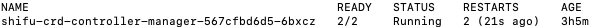

# Demo 更新 卸载与恢复

## 更新 ***Shifu*** Demo

:::note
在安装新版 ***Shifu*** Demo 之前请先卸载老版本的 ***Shifu***。
:::

前往 [**Shifu** Demo 下载](https://shifu.run/disclaimer) 页面 下载最新的 ***Shifu*** 安装包。

:::note
***Shifu*** Demo 安装包会在 ***Shifu*** 更新时更新。
:::

## 卸载 ***Shifu*** Demo

确保您当前在 `testdir` 文件夹下。 

使用以下命令完成 ***Shifu*** Demo 的卸载：

```bash
sudo ./test/scripts/deviceshifu-demo-aio_build.sh delete_demo
```

:::caution
该命令会卸载 `kind`、`kubectl`、***Shifu***、***Shifu*** Demo、***Shifu*** 使用到的镜像 以及 ***Shifu*** Demo文件夹，请谨慎使用。
:::

## 恢复 ***Shifu*** Demo

请先确保您的 `docker` 处于运行状态，如果您不清楚您的 `docker` 是否运行，请打开终端 (`Terminal`) 在命令行中执行下面的命令:

```bash
sudo docker ps -a
```

如果 `Docker` 运行顺利，将会得到以下输出:  


您可以使用以下命令查看 `kind` 容器的运行状态：

```bash
sudo docker ps -a 
```

如果您未看到任何输出时，表示您没有运行 `kind` 容器，请前往 [下载安装](../tutorials/demo-install.md) 进行安装。

如果您看到的 `Status` 为 `Up` 时，表示您当前的 `kind` 容器正在运行中。


如果您看到的 `Status` 为 `Exited` 时，表示您当前的 `kind` 容器未在运行中，您可以通过以下命令启动。


```bash
sudo docker start kind-control-plane
```

接下来请使用以下命令查看 ***Shifu*** 的运行情况。

```bash
sudo kubectl get pod -n shifu-crd-system
```

如果您的输出为以下，即 `Status` 为 `Running` 则表示 ***Shifu*** 已运行，您可以前往[体验试用](../tutorials/demo-try.md) 继续体验。



如果没有输出或者输出错误，即 `Status` 为 `Failed` 时则表示 ***Shifu*** 未运行或者运行失败，您可以前往[下载安装](../tutorials/demo-install.md)进行安装。
