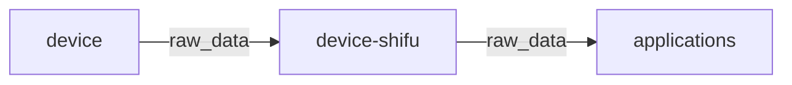
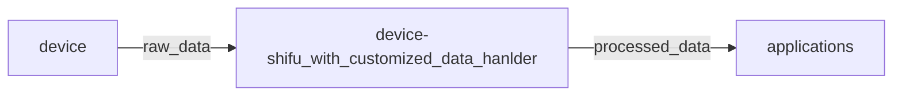

# 自定义的deviceShifu数据处理程序

***Shifu*** 允许用户自定义 ***deviceShifu***，让数字孪生更加高效。

## 默认情况

默认情况下，从设备到 ***deviceShifu*** 的数据将以其原始格式提供。



## 自定义处理

在添加了定制的逻辑后，***deviceShifu*** 可以对数据进行处理，使其更适合应用：

1. 将数据转换成用户需要的格式。
2. 过滤掉不需要的数据。
3. 进行动态计算和数据分析。



## 添加自定义的 ***deviceShifu***

在我们开始运行 ***Shifu***之前，要先做三件事。

1. 在 `customized_handlers.py` 中编写数据处理逻辑，处理方法的一般结构是这样的：
    ```python
    #使用指令/API名称作为方法名称
    def humidity(raw_data): 
        new_data = process(raw_data)
        return new_data
    ```
2. 将 `customized_handlers.py` 移到 `pkg/deviceshifu/pythoncustomizedhandlers` 中。
3. 生成 ***deviceShifu***。

## 示例：湿度检测器

这里使用的示例设备在 `examples/deviceshifu/customized/humidity_detector` 目录下。

这个设备是一个虚拟的湿度检测器，它将使用 `HTTP` 提供 `JSON` 格式的湿度和温度数据，指令/API只有 `humidity`。

### 0.建立湿度检测器的虚拟设备

第一步是用 `humidity-detector.go` 和它在 `examples/deviceshifu/customized/humidity_detector` 中的 Dockerfile 建立 `humidity-detector` 的docker镜像。

### 1. 添加定制的数据处理程序

在 `examples/deviceshifu/customized/humidity_detector/pythoncustomizedhandlers` 中，有一个 `customized_hanlders.py` 文件，将该文件复制到 `pkg/deviceshifu/pythoncustomizedhandlers` 中。

### 2. 编辑deviceShifu的Docker文件

将 `examples/deviceshifu/customized/humidity_detector/sample_deviceshifu_dockerfiles/Dockerfile.deviceshifuHTTP` 复制到 `dockerfiles`。

### 3. 添加数据处理程序的映射

在`examples/deviceshifu/customized/humidity_detector/configuration`中的`deviceshifu-humidity-detector-configmap.yaml`文件，将您的设备指令,与数据处理程序的funcName，进行映射。

（例如：instructions为 '/humidity_custom' ， funcName为 'humidity'）

则需要在`customInstructionsPython`下设置`humidity_custom: humidity`并在`instructions.instructions`和`telemetries.telemetries.device_health.properties.instruction`下设置设备指令Instructions

如下所示：

```yaml
data:
  customInstructionsPython: |
    humidity_custom: humidity 
    #humidity_custom 是instructions，humidity是处理程序funcName
  instructions: |
    instructions:
      humidity:
      humidity_custom:
  telemetries: |
    telemetries:
      device_health:
        properties:
          instruction: humidity_custom
```

### 4. 建立deviceShifu的docker镜像

构建一个新的 ***deviceShifu***镜像用来添加定制的数据处理程序。

在 `shifu` 的根目录下，运行以下命令来构建 ***deviceShifu*** 的docker镜像。

```
make buildx-build-imag-deviceshifu-http-http
```

### 5. 启动Shifu

这部分与[快速启动演示](i18n\zh-Hans\docusaurus-plugin-content-docs\current\tutorials\demo-install.md)中的内容完全一样。

在 ***Shifu*** 运行后，我们需要将新建立的湿度检测器虚拟设备导入到 `kind` 集群中。

```
kind load docker-image humidity-detector:v0.0.1
```

### 6. 检查处理后的数据

来自这个虚拟设备的原始数据应该由 `customized_hanlders.py` 中定义的自定义处理程序来处理。

在 nginx shell 中，我们应该可以 curl API `humidity` 并检查结果是否被处理，结果如下：

```json
[
  {
  "unit": "℃", 
  "code": "20990922009", 
  "exception": "temperature is too high", 
  "name": "atmosphere temperature", 
  "val": "37"
  }, 
  {
    "unit": "%RH", 
    "code": "20990922009", 
    "exception": "humidity is too high", 
    "name": "atmosphere humidity", 
    "val": "88"
  }
]
