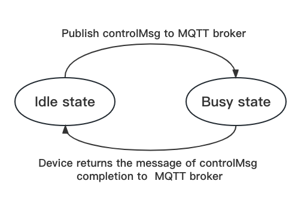

---

sidebar_position: 3

---

# 实现FSM(有限状态机)

## 介绍

​**有限状态机**（英语：finite-state machine，缩写：**FSM**）又称**有限状态自动机**（英语：finite-state automaton，缩写：**FSA**），简称**状态机**，是表示有限个状态以及在这些状态之间的转移和动作等行为的数学计算模型。[查看百度百科](https://baike.baidu.com/item/有限状态自动机/2850046)

​**FSM**由一些状态和转移构成，每个状态表示系统的一种潜在状态，每个转移表示从一个状态到另一个状态的转换。FSM的运行过程是通过接收输入来触发转换的，当FSM接收到一个输入时，它会从当前状态转移到下一个状态。

​在工程学中，FSM可以用来描述机器的控制系统。例如，一个机器的控制系统可能有多种状态，比如“运行”、“暂停”、“停止”等。每种状态都有不同的输入和输出，并且有不同的转移规则。例如，当机器处于“运行”状态时，接收到“暂停”的输入可能会使机器转移到“暂停”状态，而接收到“停止”的输入可能会使机器停止运行。

### 设计

​在MQTT ***DeviceShifu***中实现最简单的FSM模型。设备初始状态为空闲状态。在使用MQTT ***DeviceShifu***向设备发送指令后，设备由空闲状态转移到忙碌状态（设备处于忙碌状态时，阻止其它指令的接收）；在设备完成指令时，设备向MQTT Broker返回完成信息，设备由忙碌状态转移到空闲状态。




### 功能

​在您的集群中运行下面的命令，向设备发送`moving_the_device`的指令，设备进入忙碌状态:

```bash
sudo kubectl exec -it nginx -- curl -X POST -d 'moving_the_device' http://deviceshifu-mqtt.deviceshifu.svc.cluster.local/get_topicmsg1  
```

​设备在忙碌状态时会拒绝接收新的指令。

​在忙碌状态时发送新的`rotating_the_device`指令：

```bash
sudo kubectl exec -it nginx -- curl -X POST -d 'rotating_the_device' http://deviceshifu-mqtt.deviceshifu.svc.cluster.local/get_topicmsg1
```

​MQTT ***deviceShifu***返回如下：

```bash
Device is blocked by moving_the_device mutexInstruction now! 2023-01-02 07:14:28.324501338 +0000 UTC m=+67770.982000572
```

​在设备完成指令后，会向MQTT Broker发送指令完成的响应，恢复空闲状态。

​模拟设备完成指令时，返回的对应指令的完成信息`device_finished_moving`:

```bash
sudo kubectl exec -it deploy/mosquitto -n devices -- mosquitto_pub -h localhost -d -p 1883 -t /test/test1 -m "device_finish_moving" 
```

​此时，设备已恢复空闲状态，可以接收其它指令。


### 使用

​设备控制命令`mutexInstruction`及其对应的完成响应，均在`examples/mqttDeviceShifu/mqtt_deploy/mqtt_edgedevice.yaml`文件中配置。

```yml
...
data:
	...
  mutexInstructions: | 
  # 可选，配置mutexInstructions，格式为"key: value", key是向设备发送的mutex指令，设备执行mutex指令时进入忙碌状态，拒绝接收其它指令，value是设备返回给MQTT broker的完成响应，表示设备已完成对应mutex指令，恢复空闲状态 
    Moving_the_device: "Device_finished_moving" # 修改此值
    Rotating_the_device: "Device_finished_Rotating" 
    ... # 根据自己的需要可继续配置mutexInstruction及对应说明，只需按照此格式继续添加即可
```
