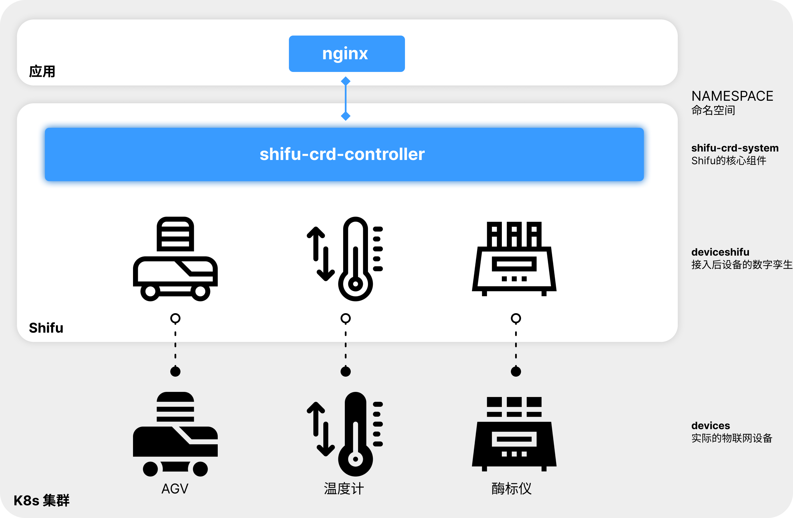
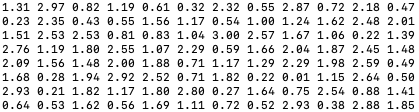
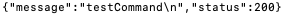
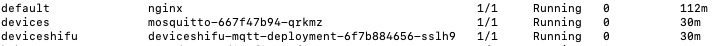
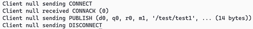
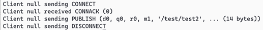
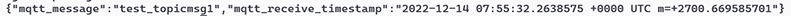
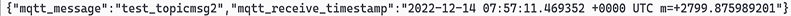

# 体验 ***Shifu***

***Shifu*** 安装包 中准备了五个设备(`AGV`，`温度计`，`酶标仪`，`PLC`，`机械臂`）供您进行试玩，体验 ***Shifu*** 的能力。

:::note
物联网设备是指可以与其他设备、系统、服务进行本地或在线地连接和交流的设备，例如：

- 一个制造厂里的机械臂，它可以接收来自本地的自动化控制系统传来的命令并完成相应的动作。
- 一辆自动导引车，操纵者可对其进行远程控制。
- 一辆汽车上的温度计，它向车载空调发出命令使其升温或降温，并上传实时温度数据到云端。

在安装 ***Shifu*** 安装包 时，我们创建了五个虚拟设备，并连接到您的电脑上。这五个设备与实际的物联网设备是等价的。
:::

## 准备

我们需要启动一个 `nginx` 来和数字孪生设备 ***deviceShifu*** 交互，请运行下面的命令：

```bash
sudo kubectl run --image=nginx:1.21 nginx
sudo kubectl get pods -A | grep nginx
```

可以看到 `nginx` 已经在运行：


:::note
在实际的情况中，物联网设备的用户使用应用程序或者监控平台与数字孪生 ***deviceShifu*** 交互。这里 `nginx` 相当于一个应用程序或者一个监控平台。
:::

## 1. 与AGV交互

<details>
  <summary> 点此查看AGV细节 </summary>
  Q：什么是AGV? <br/>
  A：AGV是一种自动导引运输车，具体介绍可以<a href="https://baike.baidu.com/item/自动导引运输车/15535355">查看百度百科</a>。<br/>
  Q：这个试玩中如何与AGV交互? <br/>
  A：当AGV的数字孪生接收到get_position命令时会生成并返回设备当前位置的x、y轴坐标。
</details>

### 创建数字孪生

:::note
您刚才通过 ***Shifu*** 安装包 安装了 ***Shifu***，AGV的数字孪生 ***deviceShifu*** 已自动创建，所以您无需进行手动的创建过程，可以直接和AGV的数字孪生进行交互。

数字孪生的状态会和实际设备的状态一致，与数字孪生交互相当于与实际物联网设备交互。
:::


执行下面的命令，我们可以看到AGV的数字孪生已经正常启动：

```bash
sudo kubectl get pods -A | grep agv
```


### 与数字孪生交互

我们需要先进入 `nginx`：

```bash
sudo kubectl exec -it nginx -- bash
```

我们可以与AGV的数字孪生通过 `http://deviceshifu-agv.deviceshifu.svc.cluster.local` 进行交互，得到AGV的当前 `x`, `y` 坐标：

```bash
curl http://deviceshifu-agv.deviceshifu.svc.cluster.local/get_position; echo
```


:::note
交互结束后按下 `ctrl D` 即可退出 `nginx`。
:::

## 2. 与温度计交互

<details>
  <summary> 点此查看温度计细节 </summary>
  Q：在这个试玩中如何与温度计交互?<br/>
  A：当温度计的数字孪生接收到read_value命令时会生成并返回当前温度计的读数。
</details>

### 创建数字孪生

首先，我们创建一个温度计的数字孪生：

```bash
sudo kubectl apply -f run_dir/shifu/demo_device/edgedevice-thermometer
```

我们可以看到温度计的数字孪生已经正常启动：

```bash
sudo kubectl get pods -A | grep thermometer
```


### 与数字孪生交互

我们需要先进入 `nginx`：

```bash
sudo kubectl exec -it nginx -- bash
```

我们可以与温度计的数字孪生通过 `http://deviceshifu-thermometer.deviceshifu.svc.cluster.local` 进行交互，得到温度计的测量温度（以下结果随机）：

```bash
curl http://deviceshifu-thermometer.deviceshifu.svc.cluster.local/read_value; echo
```


我们也可以通过 `get_status` 命令得到温度计当前运行状态（以下结果随机）：

```bash
curl http://deviceshifu-thermometer.deviceshifu.svc.cluster.local/get_status; echo
```


```bash
curl http://deviceshifu-thermometer.deviceshifu.svc.cluster.local/get_status; echo
```


:::note
交互结束后按下 `ctrl D` 即可退出 `nginx`。
:::

## 3. 与酶标仪交互

<details>
  <summary> 点此查看酶标仪细节 </summary>
  Q：什么是酶标仪? <br/>
  A：酶标仪是一种实验室设备，具体介绍可以<a href="https://baike.baidu.com/item/%E9%85%B6%E6%A0%87%E4%BB%AA">查看百度百科</a>。<br/>
  Q：在这个试玩中如何与酶标仪交互? <br/>
  A：当酶标仪的数字孪生接收到命令get_measurement会返回8*12的矩阵，其中的每一个数字代表一个样本中光谱分析扫描的结果数值。
</details>

### 创建数字孪生

首先，我们启动酶标仪的数字孪生：

```bash
sudo kubectl apply -f run_dir/shifu/demo_device/edgedevice-plate-reader
```

我们可以看到酶标仪的数字孪生已经启动：

```bash
sudo kubectl get pods -A | grep plate
```




### 与数字孪生交互

我们需要先进入 `nginx`:

```bash
sudo kubectl exec -it nginx -- bash
```

我们可以和酶标仪的数字孪生通过 `http://deviceshifu-plate-reader.deviceshifu.svc.cluster.local` 进行交互，得到酶标仪的测量结果：

```bash
curl "deviceshifu-plate-reader.deviceshifu.svc.cluster.local/get_measurement"
```



:::note
交互结束后按下 `ctrl D` 即可退出 `nginx`。
:::

## 4. 与PLC交互

<details>
  <summary> 点此查看PLC细节 </summary>
  Q：什么是PLC? <br/>
  A：PLC是一种非常普遍的工业控制器，具体介绍可以<a href="https://baike.baidu.com/item/%E5%8F%AF%E7%BC%96%E7%A8%8B%E9%80%BB%E8%BE%91%E6%8E%A7%E5%88%B6%E5%99%A8/84414?fromtitle=PLC&fromid=275974">查看百度百科</a>。<br/>
  Q：在这个试玩中如何与PLC交互? <br/>
  A：当PLC的数字孪生接收到 sendsinglebit 命令可以修改内存区域中一个bit，接收到 getcontent 命令可以得到内存区域中一个byte的值。
</details>

### 创建数字孪生

首先，我们启动PLC的数字孪生：

```bash
sudo kubectl apply -f run_dir/shifu/demo_device/edgedevice-plc
```

通过如下指令，可以看到PLC设备的数字孪生已经启动：

```bash
sudo kubectl get pods -A | grep plc
```


### 与数字孪生交互

我们需要先进入 `nginx`：

```bash
sudo kubectl exec -it nginx -- bash
```

我们可以与PLC的数字孪生通过 `http://deviceshifu-plc.deviceshifu.svc.cluster.local` 进行交互，将PLC `Q0内存` 的第0位设置成 `1`：

```bash
curl "deviceshifu-plc.deviceshifu.svc.cluster.local/sendsinglebit?rootaddress=Q&address=0&start=0&digit=0&value=1"; echo
```


`digit` 表示PLC内存的第几个比特，`value` 表示当前比特的值，通过修改 `digit` 与 `value` 的数值可以更改对应内存空间比特的值。例如一个PLC的 `Q0内存` 的第四位值代表控制程序，设定 `digit=3` 与 `value=1` 就可以开启程序：

```bash
curl "deviceshifu-plc.deviceshifu.svc.cluster.local/sendsinglebit?rootaddress=Q&address=0&start=0&digit=3&value=1"; echo
```


:::note
交互结束后按下 `ctrl D` 即可退出 `nginx`。
:::

## 5. 与机械臂交互

<details>
  <summary> 点此查看机械臂细节 </summary>
  Q：什么是机械臂? <br/>
  A：机械臂是一种非常普遍的工业控制器，具体介绍可以<a href="https://baike.baidu.com/item/%E6%9C%BA%E6%A2%B0%E8%87%82/2178090">查看百度百科</a>。<br/>
  Q：在这个试玩中如何与机械臂交互? <br/>
  A：当机械臂的数字孪生接收到 get_coordinate 命令后会返回其当前的 x, y, z轴坐标。
</details>

### 创建数字孪生

首先，我们创建一个机械臂的数字孪生：

```bash
sudo kubectl apply -f run_dir/shifu/demo_device/edgedevice-robot-arm
```

通过如下指令，可以看到机械臂的数字孪生已经启动：

```bash
sudo kubectl get pods -A | grep robotarm
```


### 与数字孪生交互

我们需要先进入 `nginx`：

```bash
sudo kubectl exec -it nginx -- bash
```

我们可以与机械臂的数字孪生通过`http://deviceshifu-robotarm.deviceshifu.svc.cluster.local`进行交互，得到机械臂的坐标：

```bash
curl http://deviceshifu-robotarm.deviceshifu.svc.cluster.local/get_coordinate; echo
```


我们也可以与机械臂的数字孪生通过`http://deviceshifu-robotarm.deviceshifu.svc.cluster.local`进行交互，得到机械臂的运行状态（以下运行状态随机出现）:

```bash
curl http://deviceshifu-robotarm.deviceshifu.svc.cluster.local/get_status; echo
```


```bash
curl http://deviceshifu-robotarm.deviceshifu.svc.cluster.local/get_status; echo
```


```bash
curl http://deviceshifu-robotarm.deviceshifu.svc.cluster.local/get_status; echo
```


:::note
交互结束后按下 `ctrl D` 即可退出 `nginx`。
:::

## 6. 与OPC UA设备交互

<details>
  <summary> 点此查看OPC UA细节 </summary>
  Q：什么是OPC UA? <br/>
  A：OPC UA是应用在自动化技术的机器对机器网络传输协议，具体介绍可以<a href="https://zh.wikipedia.org/wiki/OPC_UA">查看维基百科</a>。<br/>
  Q：在这个试玩中如何与 OPC UA 交互? <br/>
  A：当OPC UA的数字孪生接收到 get_server 命令时会返回会获取 OPC UA Server信息，接收到 get_value 命令可以得到设备的一个 NodeId 的值。
</details>

### 创建数字孪生

首先，我们启动 OPC UA 的数字孪生：

```bash
sudo kubectl apply -f run_dir/shifu/demo_device/edgedevice-opcua/mock-device
sudo kubectl wait --for=condition=Available deploy/mockdevice-opcua -n devices --timeout=150s
sudo kubectl apply -f run_dir/shifu/demo_device/edgedevice-opcua
```

通过如下指令，可以看到 OPC UA 设备的数字孪生已经启动：

```bash
sudo kubectl get pods -A | grep opcua
```


### 与数字孪生交互

我们需要先进入 `nginx`：

```bash
sudo kubectl exec -it nginx -- bash
```

我们可以与 OPC UA 的数字孪生通过`http://deviceshifu-opcua.deviceshifu.svc.cluster.local`进行交互，获取OPC UA Server信息：

```bash
curl http://deviceshifu-opcua.deviceshifu.svc.cluster.local/get_server; echo
```


我们也可以与 OPC UA 的数字孪生通过`http://deviceshifu-opcua.deviceshifu.svc.cluster.local`进行交互，得到对应 NodeId 的值：

```bash
curl http://deviceshifu-opcua.deviceshifu.svc.cluster.local/get_value; echo
```


:::note
交互结束后按下 `ctrl D` 即可退出 `nginx`。
:::

## 7. 与 Socket 设备交互

<details>
  <summary> 点此查看Socket细节 </summary>
  Q：什么是Socket? <br/>
  A：Socket是一种操作系统提供的进程间通信机制，具体介绍可以<a href="https://baike.baidu.com/item/%E5%A5%97%E6%8E%A5%E5%AD%97/9637606">查看维基百科</a>。<br/>
  Q：在这个试玩中如何与Socket交互? <br/>
  A：当Socket的数字孪生接收到 cmd 命令时，会解析请求的负载的信息，并返回其中的 Command加 '\n'。
</details>

### 创建数字孪生

首先，我们启动 Socket 的数字孪生：

```bash
sudo kubectl apply -f run_dir/shifu/demo_device/edgedevice-socket/mock-device
sudo kubectl wait --for=condition=Available deploy/mockdevice-socket -n devices --timeout=150s
sudo kubectl apply -f run_dir/shifu/demo_device/edgedevice-socket
```

通过如下指令，可以看到 Socket设备的数字孪生已经启动：

```bash
sudo kubectl get pods -A | grep socket
```


### 与数字孪生交互

我们需要先进入 `nginx`：

```bash
sudo kubectl exec -it nginx -- bash
```

我们可以与 Socket 的数字孪生通过`http://deviceshifu-socket.deviceshifu.svc.cluster.local`进行交互，获取我们所发送的命令：

```bash
curl -XPOST -H "Content-Type: application/json" -d '{"command": "testCommand", "timeout":1000}' \
http://deviceshifu-socket.deviceshifu.svc.cluster.local/cmd; echo
```



:::note
交互结束后按下 `ctrl D` 即可退出 `nginx`。
:::

## 8. 与 MQTT 设备交互（支持多主题订阅）

<details>
  <summary> 点此查看 MQTT 细节 </summary>
  Q：什么是 MQTT ? <br/>
  A：MQTT 是ISO标准下基于发布/订阅范式的消息协议，具体介绍可以<a href="https://baike.baidu.com/item/MQTT/3618851">查看百度百科</a>。<br/>
  Q：在这个试玩中如何与 MQTT 交互? <br/>
  A：我们支持多主题订阅，所以MQTT的数字孪生可以拥有多个API(例：get_topicmsg1、get_topicmsg2)，当 MQTT 的数字孪生接收到命令时，会返回订阅主题中最后一条消息。
</details>

### 创建数字孪生

首先，我们启动 MQTT 的数字孪生：

```bash
sudo kubectl apply -f run_dir/shifu/demo_device/edgedevice-mqtt/mosquitto.yaml 
sudo kubectl wait --for=condition=Available deploy/mosquitto -n devices --timeout=150s
sudo kubectl apply -f run_dir/shifu/demo_device/edgedevice-mqtt
```

通过如下指令，可以看到MQTT设备的数字孪生已经启动：

```bash
sudo kubectl get pods -A 
```



### 与数字孪生交互

我们可以与 MQTT 的数字孪生通过`http://deviceshifu-mqtt.deviceshifu.svc.cluster.local`进行交互，获取我们所发送的命令：

```bash
sudo kubectl exec -it nginx -- curl http://deviceshifu-mqtt.deviceshifu.svc.cluster.local/get_topicmsg1
sudo kubectl exec -it nginx -- curl http://deviceshifu-mqtt.deviceshifu.svc.cluster.local/get_topicmsg2
```


我们可以使用 mosquitto 向MQTT服务器向多个主题发布数据。(-m 后面的数据为我们发布的的信息)

```bash
sudo kubectl exec -it deploy/mosquitto -n devices -- mosquitto_pub -h localhost -d -p 1883 -t /test/test1 -m "test_topicmsg1"
sudo kubectl exec -it deploy/mosquitto -n devices -- mosquitto_pub -h localhost -d -p 1883 -t /test/test2 -m "test_topicmsg2"
```




此时我们可以在向MQTT的数字孪生发送命令，即可得到发布的数据。

```bash
sudo kubectl exec -it nginx -- curl http://deviceshifu-mqtt.deviceshifu.svc.cluster.local/get_topicmsg1
sudo kubectl exec -it nginx -- curl http://deviceshifu-mqtt.deviceshifu.svc.cluster.local/get_topicmsg2
```





同时可以使用以下命令，通过MQTT的数字孪生向多个主题发布数据。

```bash
sudo kubectl exec -it nginx -- curl -X POST -d 'test_pulish_topic1' http://deviceshifu-mqtt.deviceshifu.svc.cluster.local/get_topicmsg1
sudo kubectl exec -it nginx -- curl -X POST -d 'test_pulish_topic2' http://deviceshifu-mqtt.deviceshifu.svc.cluster.local/get_topicmsg2
```

## 下一步

恭喜！！！:rocket: :rocket: :rocket: 您已经完成了 ***Shifu*** 的体验，接下来：

- 您可以查看左侧边栏中的
    - **用户手册**：更详细的 ***Shifu*** 使用教程。
    - **开发者手册**
        - ***Shifu*** 架构、功能解释。
        - ***Shifu*** API参考。
    - **开源社区**：查看常见问题、获取支持、获取加入开源社区等内容。
- ***Shifu*** 已经开源，如果您有兴趣，可以访问 ***Shifu*** 的 [GitHub仓库](https://github.com/Edgenesis/shifu)。
- [联系我们以获取技术支持](community/join.md)。

## 删除集群（可选）

在上述的体验过程中，***Shifu*** 安装包 在您的电脑上创建了一个集群，并在这个集群中安装了 ***Shifu***。如果您不希望该集群持续运行，可以执行下面的命令来删除这个集群：

```bash
sudo kind delete cluster
```

Docker 中的镜像也可以进行删除。使用命令 `sudo docker images` 查看所有镜像。你可以使用命令 `sudo docker rmi <image_id>` 来删除不会再用到的镜像。

:::info
使用到的镜像解释：

- `kindest/node` 用于创建本地集群
- `edgehub/deviceshifu-http-xxxx` 在此基础上生成一个 ***deviceShifu***
- `edgehub/mockdevice-xxx` 虚拟设备
- `edgehub/shifu-controller-telemetry-plugin` ***Shifu*** 插件
- `edgehub/shifu-controller` `edgehub/edgedevice-controller-multi` ***Shifu*** 控制器
- `nginx` 用于与设备交互
:::

删除下载的 ***Shifu*** 安装包 `shifu_demo_aio_xxx_xxx.tar` 和文件夹 `testdir`。

:::tip
您也可以查看更详细的 [***Shifu*** Demo 更新 卸载与恢复](i18n\zh-Hans\docusaurus-plugin-content-docs\current\guides\install\demo-update-delete-recover.md)。
:::
